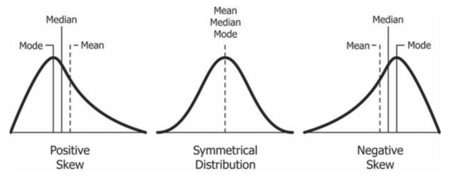

# Medidas de asimetría

Podemos decir que la asimetría indica cuánto se desvía nuestra distribución subyacente de la **distribución normal**, ya que la distribución normal tiene **asimetría 0**. Generalmente, tenemos **tres tipos de asimetría**.

1.  **Desviación simétrica**: cuando la asimetría es cercana a 0 y la media es casi la misma que la mediana.

2.  **Desviación negativa**: cuando la cola izquierda del histograma de la distribución es más larga y la mayoría de las observaciones se concentran en la cola derecha. En este caso, también podemos utilizar el término "sesgado a la izquierda" o "cola izquierda". y la **mediana es mayor que la media**.

3.  **Desviación positiva**: cuando la cola derecha del histograma de la distribución es más larga y la mayoría de las observaciones se concentran en la cola izquierda. En este caso, también podemos usar el término "sesgado a la derecha" o "cola derecha". y la **mediana es menor que la media**.
    



* Índice de simetría de **Pearson**

$$f_1=\frac{\overline{x}-Mo}{\sigma} $$

* Índice de simetría de **Fisher**

$$f_2=\frac{\sum_{i=1}^{n}\left( x_i-\overline{x}\right)^3}{n\sigma^3}$$

    - Simétrico : valores entre -0,5 y 0,5
    - Datos asimétricos moderados : valores entre -1 y -0,5 o entre 0,5 y 1
    - Datos muy sesgados : valores menores que -1 o mayores que 1

Si la distribución es simétrica, ambos índices son iguales a 0; si es asimétrica a la derecha, ambos son positivos; y si es asimétrica a la izquierda, ambos índices son negativos.

```{r fig.align='center', fig.height=4, echo=FALSE}
set.seed(5)
# normal
# x = rnorm(1000, 0, 1)  
x = c(65, 67, 70, 77, 78, 78, 80, 76, 71, 75, 87, 78, 88, 90, 98)
print(sum((x-mean(x))^3)/((length(x)-1)*sd(x)^3))
print(mean(x))
hist(x, main="Normal: Simétrica", freq=FALSE)
lines(density(x), col='red', lwd=3)
abline(v = c(mean(x), median(x)), col=c("green", "blue"), lty=c(2, 2), lwd=c(3, 3))
```

```{r fig.align='center', fig.height=5, echo=FALSE}
set.seed(5)
# exponential
# x = rexp(1000,1)
x = c(65, 67, 72, 77, 66, 78, 62, 66, 71, 75, 68, 78, 68, 90, 98)
hist(x, main="Exponencial: Simetría positiva", freq=FALSE)
lines(density(x), col='red', lwd=3)
abline(v = c(mean(x),median(x)),  col=c("green", "blue"), lty=c(2,2), lwd=c(3, 3))
print(sum((x-mean(x))^3)/((length(x)-1)*sd(x)^3))
```

```{r fig.align='center', fig.height=5, echo=FALSE}
set.seed(5)
# beta
# x= rbeta(10000, 5, 2)
x = c(88, 95, 92, 97, 96, 97, 95, 86, 91, 95, 97, 88, 85, 76, 68)
hist(x, breaks = "Sturges", main="Beta: Simetría negativa", freq=FALSE)
lines(density(x), col='red', lwd=3)
abline(v = c(mean(x), median(x)), col=c("green", "blue"), lty=c(2, 2), lwd=c(3, 3))
print(sum((x-mean(x))^3)/((length(x)-1)*sd(x)^3))
```

|   Clase   | $Y_i$ | $f_i$ | $Y_i*f_i$ |
|:---------:|:-----:|:-----:|:---------:|
| $[5,10)$  |  7.5  |   2   |    7.5    |
| $[10,15)$ | 12.5  |   3   |    25     |
| $[15,20)$ |       |   4   |   87.5    |
| $[20,25)$ | 22.5  |   7   |   157.5   |
| $[25,30]$ | 27.5  |  10   |    275    |
| $[30,35]$ |       |   8   |    195    |
|  $\sum$   |       |       |           |


<!--

```{r fig.align='center', fig.height=5, echo=FALSE}
A <- matrix(c(2, 4, 7, 5, 10, 1, 5, 3, 4, 2, 1, 17), ncol = 4)
barplot(A)
data2 = c(88, 95, 92, 97, 96, 97, 94, 86, 91, 95, 97, 88, 85, 76, 68)
data3 = c(60, 95, 50, 97, 56, 57, 54, 56, 71, 55, 57, 88, 65, 96, 58)

q1<-barplot(A, main="Motivador", horiz=F,  beside=TRUE, col=c("skyblue","red","orange"), legend = rownames(A),legend.text = rownames(A))
text(q1, A-1.2, labels = A, pos = 3, cex = .75)
boxplot(data2,data3)
medias <- c(mean(data2),mean(data3))
points(medias,pch=16,col="red")
```

```{r fig.align='center', fig.height=5, echo=FALSE}
intervalos <- seq(from = 0, to = 120, by = 10) 
data = c(88, 65, 67, 67, 76, 77, 64, 71, 61, 95, 67, 75, 65, 66, 68)
hist(data, breaks = "Sturges", freq =

       F, ylim = c(0, 0.1), xlim = c(50, 120),main='', xlab='Calificaciones', ylab = NULL, col = "aquamarine3",border = "black", labels = TRUE)

boxplot(data, horizontal=TRUE, boxwex=0.03, at=0.09, add=TRUE, axes=TRUE, col=c("GREEN", "red", "red"))
medias <- c(mean(data)) 
points(medias, pch=16, col="blue")
lines(density(data), ylim = c(0, 1), xlim = c(3, 120), lwd = 2, col="blue")
curve(dnorm(x, mean(data), sd(data)), lwd = 2, col = "black", add = T)
legend("topleft", c("Observada", "Teórica"), lty = 1, lwd = 2, col = c("black", "blue"), bty = "n", cex = 0.8)
getmode <- function(v) {
 uniqv <- unique(v)
 uniqv[which.max(tabulate(match(v, uniqv)))]
}
mode <- getmode(data)
#print(length(data))
#print(3.322+log(length(data)))
cat("Media:", mean(data))
cat("Mediana:", median(data))
cat("Moda:", mode)
cat("Quartiles:", quantile(data))
v=0.0
points(min(data), v, pch=8, col="orange")
points(max(data), v, pch=8, col="orange")
points(mode, v, pch=16, col="red")#moda
points(mean(data), v, pch=10, col='orange')#media
points(median(data), v, pch=16, col="blue")#mediana
abline(v=mean(data), col="green")
abline(v=median(data), col="blue")
abline(v=mode, col="red")

```

```{r fig.align='center', fig.height=5, echo=FALSE}
intervalos <- seq(from = 0, to = 120, by = 10) 
data = c(88, 95, 92, 97, 96, 97, 94, 86, 91, 95, 97, 88, 85, 76, 68)
hist(data,  breaks = "Sturges",freq = F, ylim = c(0, 0.1), xlim = c(50, 120),main='', xlab='Calificaciones', ylab = NULL, col = "aquamarine3",border = "black", labels = TRUE)
boxplot(data, horizontal=TRUE,boxwex=0.03, at=0.09,  add=TRUE, axes=TRUE,col=c("GREEN","red","red"))
medias <- c(mean(data)) 
points(medias,pch=16,col="blue")
lines(density(data), ylim = c(0, 1),xlim = c(3, 120), lwd = 2,col="blue")
curve(dnorm(x, mean(data), sd(data)), lwd = 2, col = "black", add = T)
legend("topleft", c("Observada", "Teórica"),lty = 1, lwd = 2, col = c("black", "blue"), bty = "n", cex = 0.8)
getmode <- function(v) {
 uniqv <- unique(v)
 uniqv[which.max(tabulate(match(v, uniqv)))]
}
mode <- getmode(data)
#print(length(data))
#print(3.322+log(length(data)))
cat("Media:",mean(data))
cat("Mediana:",median(data))
cat("Moda:",mode)
cat("Quartiles:",quantile(data))
v=0.0
points(min(data),v,pch=8,col="orange")
points(max(data),v,pch=8,col="orange")
points(mode,v,pch=16,col="red")#moda
points(mean(data),v,pch=10, col='orange')#media
points(median(data),v,pch=16,col="blue")#mediana
abline(v=mean(data), col="green")
abline(v=median(data), col="blue")
abline(v=mode, col="red")
```

```{r fig.align='center', fig.height=5, echo=FALSE}
intervalos <- seq(from = 0, to = 120, by = 10) 
data = c(65, 67, 70, 77, 78, 78, 80, 76, 71, 75, 87, 78, 88, 90, 98)
hist(data, breaks = "Sturges", freq = F, ylim = c(0, 0.1), xlim = c(50, 120), main='', xlab='Calificaciones', ylab = NULL, col = "aquamarine3", border = "black", labels = TRUE)
boxplot(data, horizontal=TRUE, boxwex=0.03, at=0.09, add=TRUE, axes=TRUE, col=c("GREEN", "red", "red"))
medias <- c(mean(data)) 
points(medias, pch=16, col="blue")
lines(density(data), ylim = c(0, 1), xlim = c(3, 120), lwd = 2, col="blue")
curve(dnorm(x, mean(data), sd(data)), lwd = 2, col = "black", add = T)
legend("topleft", c("Observada", "Teórica"), lty = 1, lwd = 2, col = c("black", "blue"), bty = "n", cex = 0.8)
getmode <- function(v) {
 uniqv <- unique(v)
 uniqv[which.max(tabulate(match(v, uniqv)))]
}
mode <- getmode(data)
#print(length(data))
#print(3.322+log(length(data)))
cat("Media:", mean(data))
cat("Mediana:", median(data))
cat("Moda:", mode)
cat("Quartiles:", quantile(data))
v=0.0
points(min(data), v, pch=8, col="orange")
points(max(data), v, pch=8, col="orange")
points(mode, v, pch=16, col="red")#moda
points(mean(data), v, pch=10, col='orange')#media
points(median(data), v, pch=16, col="blue")#mediana
abline(v=mean(data), col="green")
abline(v=median(data), col="blue")
abline(v=mode, col="red")
```
-->
