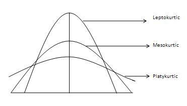

# Medidas de curtosis o apuntamiento

En estadística, usamos la medida de curtosis para describir la "cola" de la distribución, ya que describe la forma de la misma. También es una medida del "pico" de la distribución.




1.  **Mesocurtica** : esta es la distribución normal

2.  **Leptocurtica** : esta distribución tiene colas más gruesas y un pico más afilado. La curtosis es "positiva" 

3.  **Platicurtica** : La distribución tiene un pico más bajo y más ancho y colas más delgadas. La curtosis es "negativa"

## En base a la media y desviación típica

1. Datos no agrupados
$$k= \frac{\sum_{i=1}^{n}\left(x_i-\overline{x}\right)^4 }{ns^4};$$

1. Datos  agrupados
$$k= \frac{\sum_{i=1}^{n}f_i\left(x_i-\overline{x}\right)^4 }{ns^4};$$
1. Datos  agrupados en intervalos
$$k= \frac{\sum_{i=1}^{n}f_i\left(y_i-\overline{x}\right)^4 }{ns^4};$$

si $k=3$ mesocúrtica,  $k>3$ leptocúrtica,  además si $k<3$ platicúrtica

:::{.example}
Sea la tabla con intervalos


```{r curtosis1, echo=FALSE, warning = FALSE, message = FALSE, tidy=FALSE}
library(openxlsx)
opts <- options(knitr.kable.NA = "",ggrepel.max.overlaps = Inf)
new <-read.xlsx(xlsxFile="levene.xlsx", sheet=1, cols=c(5:14), rows=c(80:90), colNames=T)
knitr::kable(new, escape = FALSE, digits = 2, booktabs=T, caption='Curtosis en base a la media y desviación típica en datos tabulados en intervalos', linesep = "", longtable=T, align = "c")
```
:::


## En base a percentiles

$$k= \frac{P_{75}-P_{25}}{2\left( P_{90}-P_{10} \right) }$$
si $k < 0.263$ platicúrtica y si $k=0.263$ mesocúrtica, ademas $k > 0.263$ leptocúrtica


:::{.example}
Sea la tabla con intervalos


```{r curtosis2, echo=FALSE, warning = FALSE, message = FALSE, tidy=FALSE}
library(openxlsx)
opts <- options(knitr.kable.NA = "",ggrepel.max.overlaps = Inf)
new <-read.xlsx(xlsxFile="levene.xlsx", sheet=1, cols=c(5:14), rows=c(92:103), colNames=T)
knitr::kable(new, escape = FALSE, digits = 2, booktabs=T, caption='Curtosis en base a percentiles en datos tabulados en intervalos', linesep = "", longtable=T, align = "c")
```
:::


# Variables estadísticas bidimensionales


:::{.definition}
Sea $(X,Y)$ una variable estadistica bidimensional tal que los disitnos valores que toman $x$ e $y$ son 
$$X:x_1,x_2,\ldots, x_n$$
$$Y:y_1,y_2,\ldots, y_m.$$

Una dsitubicuion bidimensional de frecuencias es un arreglo  de los valores  observados $(x_1,y_1); (x_1,y_2); \ldots, (x_k,y_1), \ldots, (x_n,y_m),$ de la variable bidimensional $(X,Y)$, con sus respectivas frecuencias, en una tabla de doble entrada de la forma


|  Clases   |  $y_1$   |  $y_2$   | $\ldots$ |  $y_n$   |            TOTAL             |
| :------: | :------: | :------: | :------: | :------: | :--------------------------: |
|  $x_1$   | $f_{11}$ | $f_{12}$ | $\ldots$ | $f_{1n}$ |           $f_{1.}$           |
|  $x_2$   | $f_{21}$ | $f_{22}$ | $\ldots$ | $f_{2n}$ |           $f_{2.}$           |
| $\ldots$ | $\ldots$ | $\ldots$ | $\ldots$ | $\ldots$ |           $\ldots$           |
|  $x_m$   | $f_{m1}$ | $f_{m2}$ | $\ldots$ | $f_{mn}$ |           $f_{m.}$           |
|  TOTAL   | $f_{.1}$ | $f_{.2}$ | $\ldots$ | $f_{.n}$ | $n=\sum_{i=1}^m\sum_{j=1}^n$ |

:::

## Regresión y correlación lineal


:::{.definition name='Coeficiente de correlacion muestral'}
Sean $(x_1,y_1); (x_2,y_2);\ldots, (x_k,y_k)$ valores de la variable estadsitica bidimensional $(X,Y)$ cuyas frecuencias realtivas son $f_1, f_1, \ldots, f_k$ respectivamente. El coeficiente de correlacion muestral entre las variables $X$ e $Y$ es:
$$Corr(X,Y)=r=\frac{s_{XY}}{s_{X}s_{Y}}=\frac{Cov(X,Y)}{\sqrt{s_{X}^2}\sqrt{s_{Y}^2}}=\frac{\sum_{i=1}^kf_i(x_i-\overline{X})(y_i-\overline{Y})}{\sqrt{\sum_{i=1}^kf_i(x_i-\overline{X})^2}\sqrt{\sum_{i=1}^kf_i(x_i-\overline{Y})^2}}.$$

Donde 
:::


<!--
```{r Doge, echo=FALSE, out.width='100%', fig.pos = "!ht", fig.align="center", fig.cap="Hola"}
if (knitr::is_html_output()) {
knitr::include_url("https://www.youtube.com/embed/TTpbP5BVtiA")
} else {

}
```


```python3 {cmd=true matplotlib=true}
import matplotlib.pyplot as plt
import numpy as np

x = np.random.normal(170, 10, 250)

plt.hist(x)
plt.show()
```
```python3 {cmd=true matplotlib=true}
from matplotlib import rc
import matplotlib.pylab as plt

rc('font', **{'family': 'serif', 'serif': ['Computer Modern']})
rc('text', usetex=True)

x = plt.linspace(0,5)
plt.plot(x,plt.sin(x))
plt.ylabel(r"This is $\sin(x)$", size=20)
plt.show()
```

```python3 {cmd=true matplotlib=true}
import matplotlib.pyplot as plt
import numpy as np

x = np.array(["A", "B", "C", "D"])
y = np.array([3, 8, 1, 10])

plt.bar(x,y)
plt.show()
```

```python3 {cmd=true matplotlib=true}
import numpy

speed = [32,111,138,28,59,77,97]

x = numpy.std(speed)

print(x)
```


wwwwwwwwwwwwwwwwwwwwwwwwwwwwwwwwwwwwwwwwwwwwwwwwwwwwwwwwwwwwwwwwwwww
-->
