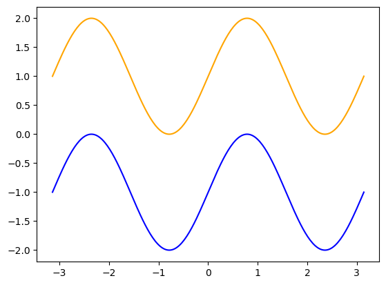

--- 
title: "Elementos  de la estadística"
subtitle: "estadística descriptiva y probabilidades"
author: "Ricardo Michel MALLQUI BAÑOS"
affiliation: "Universidad Nacional San Cristóbal De Huamanga"
date: "`r Sys.Date()`"
site: bookdown::bookdown_site
documentclass: krantz
link-citations: yes
subparagraph: yes
colorlinks: yes
fontsize: 10pt
bibliography: [book.bib, packages.bib]
biblio-style: apalike
lot: yes
lof: yes
monofont: "Source Code Pro"
monofontoptions: "Scale=0.7"
toc_appendix: yes
description: ""
always_allow_html: true
---
\newcommand{\N}{\mathbb{N}}
\newcommand{\R}{\mathbb{R}}
\newcommand{\CC}{\mathbb{C}}
\newcommand{\I}{\mathbb{I}}
\newcommand{\f}{\mathbb{f}}
\newcommand{\X}{\mathbb{X}}
\newcommand{\D}{\mathbb{D}}
\newcommand{\Z}{\mathbb{Z}}
\newcommand{\Q}{\mathbb{Q}}
\newcommand{\norm}[1]{\left\Vert#1\right\Vert}
\newcommand{\abs}[1]{\left\vert#1\right\vert}
\newcommand{\set}[1]{\left\{#1\right\}}
\newcommand{\seq}[1]{\left<#1\right>}
\newcommand{\co}[1]{\left[#1\right]}
\newcommand{\cc}[1]{\left(#1\right)}
\newcommand{\J}{\mathcal{J}}
\newcommand{\K}{\mathcal{K}}
\newcommand{\M}{\mathcal{M}}
\newcommand{\F}{\mathcal{F}}

# Resumen {-}

La estadística es la ciencia que manipula datos las analiza e interpreta para poder sacar concluciones razonables de ciertos fenomenos naturales. Esta ciencia puede ser dividido en dos: **estadística descirptiva** y  **estadística inferencial**. En la estadística descriptiva se procesan datos de una manera teórica y utilitaria. Estos métodos consisten en la recolección, organización, resumen, descripcion y presenatacion de la información. Si la poblacion está disponible entonces la estadística descriptiva es suficiente para describir ciertos fenomenos. No obstante generalmente no se dispone de toda la población si no de una muestra de ella, es en este caso que se requieren usar técnicas más sofisticadas para tomar decisiones y generalizaciones acerca de la poblacion, desde una pequeña muestra de información. Es cuando entra en el juego la estadística inferencial.

La base teórica de la estadística son las matemáticas 


Este libro se compone de dos partes, la primera parte trata sobre la **estadística descirptiva** y la segunda  **estadística inferencial**. Cada una de ellas divididas en capítulos.


<!--chapter:end:index.Rmd-->

\mainmatter

# (PART) Estadística descriptiva {.unnumbered}

# Prerrequisitos

Matemáticas basicas

# Variables

Es una **característica** de personas cosas u objetos que son propensos a ser medidas o cualificadas

## Variables cualitativas

Denotan cualidades de objetos personas o animales tales como características inherentes que *no son medibles por números*, tenemos dos casos de esta variable.

### Nominales

Son caracteristicas que simplemente nominan y están propensos a ser jerarquizados u ordenados tales como: El estado civil (soltero, casado, divorciado, viudo), Religión (católica, evangélico, judío, etc).

### Ordinales

Son caracteristicas que que si están propensos a ser jerarquizados tales como: Nivel de instrucción (inicial, primaria, secundaria, superior).

## Variables cuantitativas

Son aquellas variables que están propensos a ser medidas mediante números ya sean números enteros o reales.

### Discretas

Aquellas que solo son medidos mediante números enteros por ejemplo: Número de hijos, número de habitaciones.

### Continuas

Aquellas que solo son medidos mediante números reales es decir este incluye a los números racionales e irracionales. Estatura, volumen, peso.

## Ejercicios propuestos

1.  Reconozca **5** variables **cualitativas** de una persona, atmósfera y una pintura

    -   Persona

        -   Color (moreno, blanco, trigueño)
        -   Religión (católico, evangélico, pentecostal, etc)
        -   ...
        -   ...
        -   ...

    -   Atmósfera

        -   ...
        -   ...
        -   ...
        -   ...
        -   ...

    -   Pintura

        -   ...
        -   ...
        -   ...
        -   ...
        -   ...

2.  Reconozca **5** variables **cuantitativas** de una video, tela, un celular.

    -   Video

        -   Duración ($x$ segundos)
        -   Numero video en youtube a la semana ($n$ cantidades)
        -   ...
        -   ...
        -   ...

    -   Tela

        -   ...
        -   ...
        -   ...
        -   ...
        -   ...

    -   Celular

        -   ...
        -   ...
        -   ...
        -   ...
        -   ...

# Organización de datos en tablas de frecuencias

## Distribución de frecuencias

La tabulación es un proceso en el cual los datos son ordenados en grupos llamados *clases* para un análisis más eficaz de estos, los datos podrían estar clasificados mediante una variable cualitativa o cuantitativa en el caso de las variables cualitativas $Y_i$, se considera la siguiente Tabla \@ref(tab:ww)

|  $Y_i$   |  $f_i$   |  $F_i$   | $F_i^*$  |      $h_i$      |      $H_i$      |      $H_i^*$      | $h_i\%$  | $H_i\%$  | $H_i^*\%$ |
|:--------:|:--------:|:--------:|:--------:|:---------------:|:---------------:|:-----------------:|:--------:|:--------:|:---------:|
|  $Y_1$   |  $f_1$   |  $F_1$   | $F_1^*$  | $\frac{f_1}{n}$ | $\frac{F_1}{n}$ | $\frac{F_1^*}{n}$ |  $h_1$   |  $H_1$   |  $H_1^*$  |
|  $Y_2$   |  $f_2$   |  $F_2$   | $F_2^*$  | $\frac{f_2}{n}$ | $\frac{F_2}{n}$ | $\frac{F_2^*}{n}$ |  $h_2$   |  $H_2$   |  $H_1^*$  |
|  $Y_3$   |  $f_3$   |  $F_3$   | $F_3^*$  | $\frac{f_3}{n}$ | $\frac{F_3}{n}$ | $\frac{F_3^*}{n}$ |  $h_3$   |  $H_3$   |  $H_1^*$  |
| $\vdots$ | $\vdots$ | $\vdots$ | $\vdots$ |    $\vdots$     |    $\vdots$     |     $\vdots$      | $\vdots$ | $\vdots$ | $\vdots$  |
|  $Y_r$   |  $f_r$   |  $F_r$   | $F_r^*$  | $\frac{f_r}{n}$ | $\frac{F_r}{n}$ | $\frac{F_r^*}{n}$ |  $h_r$   |  $H_r$   |  $H_1^*$  |

: (\#tab:ww) Caption

En el caso de variables cuantitativas ademas si los datos son muy variados, que para se clasificados adecuadamente, necesitan generarse particiones de longitudes semejantes entonces se utiliza el siguiente proceso; el **número de las particiones** $r$ se consideran de acuerdo a **tres criterios**

1.  Criterio del investigador $r$ no puede ser más de 20 ni menos de 5

2.  $r=\sqrt{n}$ donde $n$ es el número de datos

3.  La regla de Starges que consiste en considerar la fórmula $r=3.322\cdot\log_{10} n$ Una vez establecido el número de particiones se procede a generar los límites laterales de cada una de las particiones, sea $L$ la longitud de todo el conjunto es decir $L=x_{\text{max}}-x_{\text{min}}$ entonces la longitud de las particiones o amplitud interválica se obtiene con $l=\frac{L}{r}$

```{r cuantitativaw, echo=FALSE, warning = FALSE, message = FALSE, tidy=FALSE}
library(openxlsx)
opts <- options(knitr.kable.NA = "",ggrepel.max.overlaps = Inf)
new <-read.xlsx(xlsxFile="levene.xlsx", sheet=2, cols=c(1:11), rows=c(1:5), colNames=T)
knitr::kable(new, escape = FALSE, digits = 2, booktabs=T, caption='Datos cuantitativos (intervalos)', linesep = "", longtable=T, align = "c")
```

Tenga en cuenta que $n$ es el número de datos, es decir $n=f_1+f_2+\ldots+f_r=\sum_{i=1}^r$ donde $f_i$ es número de datos en la partición $X_i$, una de las $r$ particiones del conjunto total de datos.

1.  Las **frecuencias absolutas**\index{frecuencias absolutas} $f_i$ indican el número de datos con la característica $X_i$.

2.  Las **frecuencias absolutas acumuladas menor que**\index{frecuencias absolutas acumuladas menor que} $F_i$ obedecen a la fórmula $$F_m=f_1+f_2+\ldots+f_m=\sum_{i=1}^mf_i$$

3.  Las **frecuencias absolutas acumuladas mayor que** $F_i^*$ obedecen a la fórmula $$
    \begin{aligned}
    F_m^*&=f_m+f_{m+1}+\ldots+f_r\\
    &=\sum_{i=m}^rf_i\\
    &=n-\sum_{i=1}^{m-1}f_i\\
    &=n-\left(f_1+f_{2}+\ldots+f_{m-1}\right)
    \end{aligned} 
    $$

4.  Las **frecuencias absolutas relativas**\index{frecuencias absolutas relativas} obedecen a la fórmula $$h_m=\frac{f_m}{n}$$

5.  Las **frecuencias absolutas relativas menor que**\index{frecuencias absolutas relativas  menor que} obedecen a la fórmula $$H_m=\frac{f_m}{n}$$

6.  Las **frecuencias absolutas relativas mayor que** obedecen a la fórmula $$H_m^*=\frac{F_m}{n}$$

7.  Las **frecuencias absolutas relativas porcentuales** obedecen a la fórmula $h_i\%=100\cdot h_i$

8.  Las **frecuencias absolutas relativas menor que porcentuales** obedecen a la fórmula $H_i\%=100\cdot H_i$

9.  Las **frecuencias absolutas relativas mayor que porcentuales** obedecen a la fórmula $H_i^*\%=100\cdot H_i^*$

10. $Y_i$ marca de clase o punto medio de la clase $i$

## Ejemplo sin intervalos

```{exercise}
Sean Los 16 tipos de personalidad en un grupo social encuestado. 

1. ESTJ (Extraverted Sensing Thinking Judging)
Personas a las que les gusta tener el control sobre lo que ocurre a su alrededor, siempre buscan la manera de que todo funcione como debe y, si es necesario, la implementan ellos mismos.

2. ESTP ((Extraverted Sensing Thinking Perceiving)
Las personas que pertenecen a esta categoría son espontáneas, alegres y activas, pero al igual que lo que ocurre con los ESTJ, tienden a ejercer dominio sobre los demás, en este caso a través de su capacidad de observación y su carisma.

3. ESFJ (Extraverted Sensing Feeling Judging)
Se trata de personas muy volcadas en la atención de las necesidad de los demás, especialmente si forman parte de su círculo cercano: familia y amistades. Por eso siempre que pueden prestan su ayuda y procuran que sus círculos sociales cercanos permanezcan siempre estables y con buena salud. Por eso tienden a evitar que aparezcan conflictos fuertes y se muestran diplomáticas cuando hay choques de intereses.

4. ESFP (Extraverted Sensing Feeling Perceiving)
Se trata de personas alegres y espontáneas que disfrutan entreteniéndose y entreteniendo a los demás. La diversión es uno de los pilares más importantes de sus vidas, y son de trato cercano y temperamento cálido. Aman la novedad y hablar acerca de experiencias personales.

5. ISTJ (Introverted Sensing Thinking Perceiving)
Un tipo de personalidad definido por su fuerte sentido de la moralidad y del deber. Les gusta planear e implementar sistemas de reglas que permitan que equipos y organizaciones funcionen con una clara lógica y orden. Dan un gran valor a las normas y a la necesidad de que la realidad se corresponda con cómo deberían ser las cosas. Aunque son personas introvertidas, no rehuyen la interacción con los demás.

6. ISTP (Introverted Sensing Thinking Perceiving)
Se trata de personas reservadas, orientadas a la acción y a las soluciones prácticas ante problemas del día a día. También son definidas por su tendencia hacia el pensamiento lógico y su espontaneidad y autonomía. Les gusta explorar entornos y descubrir modos en los que se puede interactuar con ellos.

7. ISFJ (Introverted Sensing Feeling Judging)
Son personas definidas principalmente por sus ganas de proteger y ayudar a los demás y, en definitiva, de resultar confiables para los otros.Se esfuerzan por hacer todo lo que se espera de ellas, pero no tienen grandes aspiraciones ni se muestran muy ambiciosas. Tienden a pensar que es malo pedir compensaciones o aumentos a cambio de los sacrificios que realizan a la hora de trabajar, ya que este debería ser una meta en sí.

8. ISFP (Introverted Sensing Feeling Perceiving)
Personas que viven totalmente en el aquí y el ahora, en constante búsqueda de la novedad y de las situaciones sensorialmente estimulantes. Son reservadas, pero también alegres, espontáneas y cálidas con sus amistades.Tienen un especial talento en el mundo de las artes.

9. ENTJ (Extraverted Intuitive Thinking Judging)
Este es uno de los 16 tipos de personalidad más relacionados con el liderazgo y la asertividad. Las personas descritas por esta categoría son comunicativas, de pensamiento ágil y analítico y predispuestas a encabezar equipos y organizaciones. Se adaptan bien al cambio y hacen que sus estrategias también se amolden cada vez que el entorno varía. Además, casi siempre saben cómo explicar sus proyectos o historias de manera que resulten de interés para el resto, lo cual los convierte en comerciales muy aptos.

10. ENTP (Extraverted Intuitive Thinking Perceiving)
Personas especialmente movidas por la curiosidad y por los retos que para ser resueltos requieren afrontar preguntas intelectualmente estimulantes. Su agilidad mental y su facilidad para detectar inconsistencias lógicas hace de ellas personas predispuestas a interesarse por la ciencia o la filosofía. Además, su tendencia a mostrarse competitivas las vuelve personas muy activas durante el día, siempre intentando llegar a soluciones innovadoras a problemas complejos.

11. ENFJ (Extraverted Intuitive Feeling Judging)
Personas que aprenden constantemente acerca de todos los ámbitos del conocimiento (o una buena parte de ellas) y ayudan a aprender a las demás, guiándolas en su propia evolución. Les gusta ofrecer tutela y consejo, y son muy buenas influyendo en la conducta de los demás. Se centran en sus valores e ideales y hacen lo posible por mejorar el bienestar del mayor número de personas a través de sus ideas y sus acciones.

12. ENFP (Extraverted Intuitive Feeling Perceiving)
Uno de los 16 tipos de personalidad con mayor propensión al pensamiento creativo, las artes y a la sociabilidad. Son alegres, disfrutan de la interacción con otras personas, y actúan teniendo en mente su posición como parte de un “todo” formado por la humanidad, y no se muestran individualistas. De hecho, suelen involucrarse en tareas colectivas para ayudar a los demás, pensando en el impacto social de sus acciones. Sin embargo, también se distraen fácilmente y es frecuente que posterguen tareas que consideran aburridas o demasiado simples y rutinarias.

13. INTJ (Introverted Intuitive Thinking Judging)
Un tipo de personalidad orientado hacia la resolución de problemas específicos a partir del razonamiento analítico. Las descritas por esta categoría son personas muy centradas en sus propias ideas y teorías acerca del funcionamiento del mundo, lo cual significa que analizan su entorno centrándose en sus ideas sobre cómo opera este. Son conocedoras de sus propias capacidades y confían en su propio criterio, aunque este vaya en contra de algunos superiores.

Es muy frecuente que lleguen a ser expertas en un ámbito de conocimiento muy específico, ya que les gusta tener el suficiente conocimiento sobre algo como para poder tener en cuenta todos los factores que entran en juego en su funcionamiento y, a partir de ahí, saber lo que se puede hacer o lo que pasará en el futuro.

14. INTP (Introverted Intuitive Thinking Perceiving)
Uno de los 16 tipos de personalidad más definido por la propensión a la reflexión. A estas personas les gustan las teorías con capacidad para explicar todo lo que puede ocurrir en un sistema, y su tendencia hacia el perfeccionismo hace que corrijan a los demás en múltiples ocasiones. Valoran más la exactitud en términos teóricos que el pragmatismo y la resolución de problemas concretos.

15. INFJ (Introverted Intuitive Feeling Judging)
Personas muy sensibles, reservadas y movidas por unos ideales muy definidos y que, además, sienten la necesidad de hacer que los demás también se beneficien de estos ideales. Esto hace que sean propensas tanto a la reflexión como a la acción, lo cual puede llegar a suponer tanto trabajo que se sobrecargan por tener demasiadas responsabilidades. Muestran una gran capacidad para interpretar exitosamente los estados mentales de los demás y tratan de utilizar esta información para ayudarlas antes de que la otra persona se lo pida.

16. INFP (Introverted Intuitive Feeling Perceiving)
Menos moralistas que los INFJ, los INFP también se preocupan mucho por ayudar a los demás desde su posición de personas reservadas. Muestran una sensibilidad estética y artística que las vuelve creativas.

```

::: {solution}

Se tiene 16 características con los siguientes datos  

| Personalidad | Cantidad |
|:------------:|:--------:|
|     ESTJ     |    1     |
|     ESTJ     |    2     |
|     ESTP     |    3     |
|     ESFJ     |    4     |
|     ESFP     |    5     |
|     ISTJ     |    6     |
|     ISTP     |    7     |
|     ISFJ     |    8     |
|     ISFP     |    9     |
|     ENTJ     |    10    |
|     ENTP     |    6     |
|     ENFJ     |    5     |
|     ENFP     |    3     |
|     INTJ     |    2     |
|     INTP     |    1     |
|     INFJ     |    1     |
|     INFP     |    1     |

: (\#tab:w1) Caption

:::

```{r cualitativa, echo=FALSE, warning = FALSE, message = FALSE, tidy=FALSE}
library(openxlsx)
opts <- options(knitr.kable.NA = "",ggrepel.max.overlaps = Inf)
new <-read.xlsx(xlsxFile="levene.xlsx", sheet=1, cols=c(5:14), rows=c(1:19), colNames=T)
knitr::kable(new, escape = FALSE, digits = 2, booktabs=T, caption='Datos cualitativos', linesep = "", longtable=T, align = "c")
```

## Example intervalos

::: {solution}

Edades de cierta comunidad 


25
35 38
45 47 48
51 52 53 55
60 62 63 66 67
70 71 72 75 77 78
81 88 89
90 99 

|   Clase    | $f_i$ |
|:----------:|:-----:|
| $[20-30>$  |   1   |
| $[30-40>$  |   2   |
| $[40-50>$  |   3   |
| $[50-60>$  |   4   |
| $[60-70>$  |   5   |
| $[70-80>$  |   6   |
| $[80-90>$  |   3   |
| $[90-100]$ |   2   |

:::

Tabulando

```javascript {cmd=true} 
const number = 50
 let n1 = 0, n2 = 1, nextTerm; console.log('Fibonacci Series:'); for (let i = 1; i <= number; i++) {     console.log(n1);     nextTerm = n1 + n2;     n1 = n2;     n2 = nextTerm; }

```


```r {cmd=true}
print("wwwwwwwwwwwwwwwww wwwwwwwwwwwwwwwwww")
``` 

```bash {cmd=true}
ls .
```

```{=html}
```{r, echo=FALSE, results='asis'}
input <- data.frame(text = c("a", "b", "c"), 
                    page_number = c(3, 5, 6))
links <- paste('<a href="', input$text, '">', input$page_number, "</a>", sep="")
cat(links, sep = "\n")
```


```{r cuantitativa, echo=FALSE, warning = FALSE, message = FALSE, tidy=FALSE}
library(openxlsx)
opts <- options(knitr.kable.NA = "",ggrepel.max.overlaps = Inf)
new <-read.xlsx(xlsxFile="levene.xlsx", sheet=1, cols=c(5:14), rows=c(30:41), colNames=T)
knitr::kable(new, escape = FALSE, digits = 2, booktabs=T, caption='Datos cuantitativos (intervalos)', linesep = "", longtable=T, align = "c")
```

# Gráficos estadísticos

## Histograma de frecuencias

```{r}
mtcars$am <- as.factor(mtcars$am)
levels(mtcars$am) <-c("Automatic", "Manual")
```

Some text

```{r fig.align='center', fig.height=4} 
hist(mtcars$mpg[mtcars$am=="Automatic"], breaks=12, main="mpg for automatic vehicles", xlab="mpg", xlim=c(10, 35))
```

## Circulares

```{r fig.align='center', fig.height=4}

par(mar = c(0, 1, 0, 1))
pie(
  c(280, 60, 20),
  c('Sky', 'Sunny side of pyramid', 'Shady side of pyramid'),
  col = c('#0292D8', '#F7EA39', '#C4B632'),
  init.angle = -50, border = NA
)
```

```{r fig.align='center', fig.height=4}

plot(cars)
lines(lowess(cars))
```

```{r fig.align='center', fig.height=4}
library(ggplot2)

# Create data
data <- data.frame(
  name=c("A","B","C","D","E") ,  
  value=c(3,12,5,18,45)
  )

# Barplot
ggplot(data, aes(x=name, y=value)) + 
  geom_bar(stat = "identity", width=0.5) +
  coord_flip()
```

## Histograma de frecuencias

```{r fig.align='center', fig.height=4}
hist(mtcars$mpg[mtcars$am=="Automatic"], breaks=12, main="mpg for automatic vehicles", xlab="mpg", xlim=c(10, 35))
```

# Medidas de tendencia central

Son aquellas medidas que buscan un dato representivo central de un conjunto de datos tales como la media, la moda y la mediana.

## La media

A veces llamada *promedio aritmético*, es la medida de tendencia central que pondera los datos.

### Media de datos no agrupados

Los datos no están agrupados cuando no están ordenados sobre una tabla de distribución de frecuencias. Sean los $n$ datos $x_1, x_2, \ldots, x_n$ entonces la media o promedio aritmético se define como

$$ 
\overline{x}=\frac{x_1+x_2+\cdots+x_n}{n}=\frac{1}{n}\sum_{i=1}^nx_i 
$$

### Media de datos agrupados

Considérese la siguiente tabla de distribucion de frecuencias entonces el promedio es $$\overline{x}=\frac{y_1f_1+y_2f_2+\cdots+y_nf_n}{n}=\frac{1}{n}\sum_{i=1}^ny_if_i$$

|      Clase      |  $Y_i$   |  $f_i$   |  $F_i$   | $\ldots$ | $H_i^*\%$ |
|:---------------:|:--------:|:--------:|:--------:|:--------:|:---------:|
|   $[y_1,y_2)$   |  $y_1$   |  $f_1$   | $\ldots$ | $\ldots$ | $H_1^*\%$ |
|   $[y_2,y_3)$   |  $y_2$   |  $f_2$   | $\ldots$ | $\ldots$ | $H_1^*\%$ |
|   $[y_3,y_4)$   |  $y_3$   |  $f_3$   | $\ldots$ | $\ldots$ | $H_1^*\%$ |
|    $\vdots$     | $\vdots$ | $\vdots$ | $\ldots$ | $\ldots$ | $\vdots$  |
| $[y_{r-1},y_r]$ |  $y_r$   |  $f_r$   | $\ldots$ | $\ldots$ | $H_1^*\%$ |

: (\#tab:www) Captionww

### Ejemplo

|   Clase   | $Y_i$ | $f_i$ | $Y_i*f_i$ |
|:---------:|:-----:|:-----:|:---------:|
| $[10,15)$ | 12.5  |   1   |   12.5    |
| $[15,20)$ | 17.5  |   2   |    35     |
| $[20,25)$ | 22.5  |   5   |   112.5   |
| $[25,30)$ | 27.5  |   3   |   82.5    |
| $[30,35]$ | 32.5  |   2   |    65     |
|  $\sum$   |       |  13   |   307.5   |

$$\overline{x}=\frac{12.5+35++112.5+82.5+65}{13}=\frac{307.5}{13}=23.65$$

```{exercise}
Si el promedio de $n$ datos es $\overline{x}$ entonces el promedio del conjunto inicial más un dato adicional $x_{n+1}$ es $$\overline{x}'=\frac{n\overline{x}+x_{n+1}}{n+1}$$ en general si se adicionan $r$ datos $y_1, y_2, \ldots y_r$ entonces el nuevo promedio será $$\overline{x}'=\frac{n\overline{x}+y_{1}+y_2+\ldots+y_r}{n+r}$$

```

```{solution}
En efecto sea el promedio 
\begin{align*}
\overline{x}'&=\frac{x_1+x_2+\cdots+x_{n+1}}{n+1}\\
&=\frac{n\frac{x_1+x_2+\cdots x_n}{n}+x_{n+1}}{n+1}\\
&=\frac{n\overline{x}+x_{n+1}}{n+1}
\end{align*}
```

## La moda (Mo)

-   La moda es el valor que tiene mayor frecuencia absoluta.

-   Se representa por $Mo$

-   Si en un grupo hay dos o varias puntuaciones con la misma frecuencia y esa frecuencia es la máxima, entonces la distribución es bimodal es decir, tiene varias modas.

-   Cuando todas las puntuaciones de un grupo tienen la misma frecuencia, no hay moda.

-   Se puede hallar la moda para variables cualitativas y cuantitativas.

-   Cuando todas las puntuaciones de un grupo tienen la misma frecuencia, no hay moda.

-   Si dos puntuaciones adyacentes tienen la frecuencia máxima, la moda es el promedio de las dos puntuaciones adyacentes.

-   Si dos puntuaciones adyacentes tienen la frecuencia máxima, la moda es el promedio de las dos puntuaciones adyacentes.Ejemplos de ejercicios de moda

### Moda de datos no tabulados

En este caso es dato que más repite en un conjunto de datos dados.

La moda es el dato que más se repite por ejemplo sea el conjunto de datos $x_1$, $x_2$, $x_2$, $x_2$, $x_3$ entonces la moda es $\text{Mo}=x_2$

Halle la moda de los siguinetes datos 3, 5,3,6,7,3,4,5,5 ya que hay hay precencia de dotas que se repiten dos veces en tonces este conjunto de datos recibe el nombre de datos bimodal Mo=3 y Mo=5

### Moda de datos tabulados

La moda es el dato que más se repite por ejemplo sea el conjunto de datos tabulados entonces la moda es $$ M_o=L_i+\frac{f_i-f_{i-1}}{(f_i-f_{i-1})+(f_i-f_{i+1})}\cdot a_i$$

-   $L_i$ es el límite inferior de la clase modal

-   $f_i$ es la frecuencia absoluta de la clase modal

-   $f_{i-1}$ es la frecuencia absoluta inmediatamente inferior a la clase modal

-   $f_{i+1}$ es la frecuencia absoluta inmediatamente posterior a la clase modal

-   $a_i$ es la amplitud de la clase

|      Clase      |  $Y_i$   |  $f_i$   |  $F_i$   | $\ldots$ | $H_i^*\%$ |
|:---------------:|:--------:|:--------:|:--------:|:--------:|:---------:|
|   $[y_1,y_2)$   |  $y_1$   |  $f_1$   | $\ldots$ | $\ldots$ | $H_1^*\%$ |
|   $[y_2,y_3)$   |  $y_2$   |  $f_2$   | $\ldots$ | $\ldots$ | $H_1^*\%$ |
|   $[y_3,y_4)$   |  $y_3$   |  $f_3$   | $\ldots$ | $\ldots$ | $H_1^*\%$ |
|    $\vdots$     | $\vdots$ | $\vdots$ | $\ldots$ | $\ldots$ | $\vdots$  |
| $[y_{r-1},y_r]$ |  $y_r$   |  $f_r$   | $\ldots$ | $\ldots$ | $H_1^*\%$ |

: (\#tab:wwwww) wwwww

### Ejemplo

|   Clase   | $f_i$ |
|:---------:|:-----:|
| $[10,15)$ |   2   |
| $[15,20)$ |   5   |
| $[20,25)$ |  10   |
| $[25,30)$ |   3   |
| $[30,35]$ |   1   |

Primeramente la mayor frecuencia absoluta es 10 y corresponde $f_3=10$ por tanto $i=3$. $L_i=20$

$$ M_o=L_i+\frac{f_i-f_{i-1}}{(f_i-f_{i-1})+(f_i-f_{i+1})}\cdot a_i=$$ $$ =20+\frac{10-5}{(10-5)+(10-3)}\cdot 5=20+\frac{5}{12}*5=22.08$$

[Más información](https://www.superprof.es/apuntes/escolar/matematicas/estadistica/descriptiva/moda-estadistica.html)

## La mediana (Me)

### Mediana de datos no tabulados

Obtener la mediana consiste en ordenar los datos de menor a mayor y considerar dos casos: El primero si el número de datos es impar entonces el dato $x_{\frac{n+1}{2}}$ del conjunto ordenado será la mediana es decir $$\text{Me}=x_{\frac{n+1}{2}}$$ de otro lado si el número de datos es par entonces la mediana es la semisuma de los dos datos intermedios es decir $$\text{Me}=\frac{x_{\frac{n}{2}}+x_{\frac{n}{2}+1}}{2}$$

::: {exercise}
Sean los conjuntos de datos 5, 6, 8, 2, 1, 5, 6, 7, 10, 0, 14 y 20, 25, 6, 5, 19, 5 obtener la mediana de estos conjuntos de datos.

:::

::: {solution}
Al ordenarlos  se obtiene el siguiente arreglo 0, 1, 2, 5, 5, 6, 6, 7, 8, 10, 14 y considerando que $x_1=0$, $x_2=1$, $\ldots$, $x_{11}=14$ en este caso el número de datos es impar entonces el dato $x_{\frac{11+1}{2}}=x_{6}=6$ el la mediana. De otro lado el segundo conjunto de datos al ser ordenados 5, 5, 6, 19, 20, 25 ademas considerando que $x_1=5$, $x_2=5$, $\ldots$, $x_6=25$ conducen a obtener la mediana $\text{Me}=\frac{x_{\frac{6}{2}}+x_{\frac{6}{2}+1}}{2}=\frac{6+19}{2}=12.5$.
:::

### Mediana de datos tabulados

La mediana se encuentra en el intervalo donde la frecuencia acumulada llega hasta la mitad de la suma de las frecuencias absolutas.

Es decir tenemos que buscar el intervalo en el que se encuentre.

$$  M_e=L_{i}+\frac{\frac{N}{2}-F_{i-1}}{f_{i}}\cdot a_{i}$$

$L_{i}$ es el límite inferior de la clase donde se encuentra la mediana

$\frac{N}{2}$ es la semisuma de las frecuencias absolutas

$f_{i}$ es la frecuencia absoluta de la clase mediana

$F_{i-1}$ es la frecuencia acumulada anterior a la clase mediana

$a_{i}$ es la amplitud de la clase

La mediana es independiente de las amplitudes de los intervalos

|      Clase      |  $Y_i$   |  $f_i$   |  $F_i$   | $\ldots$ | $H_i^*\%$ |
|:---------------:|:--------:|:--------:|:--------:|:--------:|:---------:|
|   $[y_1,y_2)$   |  $y_1$   |  $f_1$   | $\ldots$ | $\ldots$ | $H_1^*\%$ |
|   $[y_2,y_3)$   |  $y_2$   |  $f_2$   | $\ldots$ | $\ldots$ | $H_1^*\%$ |
|   $[y_3,y_4)$   |  $y_3$   |  $f_3$   | $\ldots$ | $\ldots$ | $H_1^*\%$ |
|    $\vdots$     | $\vdots$ | $\vdots$ | $\ldots$ | $\ldots$ | $\vdots$  |
| $[y_{r-1},y_r]$ |  $y_r$   |  $f_r$   | $\ldots$ | $\ldots$ | $H_1^*\%$ |

: (\#tab:mediana) Mediana

[Más información](https://www.superprof.es/apuntes/escolar/matematicas/estadistica/descriptiva/mediana.html)

### Ejemplo

|   Clase   | $f_i$ | $F_i$ |
|:---------:|:-----:|:-----:|
| $[10,15)$ |   1   |   1   |
| $[15,20)$ |   2   |   3   |
| $[20,25)$ |   5   |   8   |
| $[25,30)$ |   3   |  11   |
| $[30,35]$ |   1   |  12   |
|  $\sum$   |  12   |       |

$$\frac{N}{2}=12/2=6$$ ubicando en las frecuencias absolutas acumuladas que corresponde al intervalo $[20,25)$

$$  M_e=L_{i}+\frac{\frac{N}{2}-F_{i-1}}{f_{i}}\cdot a_{i}$$ $$  =20+\frac{\frac{12}{2}-3}{5}\cdot 5=23$$ por lo tanto la mediana de este conjunto de datos tabulados (agrupados) es $Me=23$

## Asignación

Halle le media, la moda y la mediana de los siguientes datos tabulados

|    Clase    | $Y_i$ | $f_i$ | $F_i$ |
|:-----------:|:-----:|:-----:|:-----:|
| $[100,150)$ |       |   1   |   1   |
| $[150,200)$ |       |   2   |   3   |
| $[200,250)$ |       |   5   |       |
| $[250,300)$ |       |   7   |       |
| $[300,350]$ |       |  10   |       |
| $[350,400]$ |       |   6   |       |
| $[400,450]$ |       |   5   |       |
| $[450,500]$ |       |   2   |       |
| $[500,550]$ |       |   1   |       |

$$\overline{x}=\frac{y_1f_1+y_2f_2+\cdots+y_nf_n}{n}=\frac{1}{n}\sum_{i=1}^ny_if_i$$

$$ M_o=L_i+\frac{f_i-f_{i-1}}{(f_i-f_{i-1})+(f_i-f_{i+1})}\cdot a_i$$

$$  M_e=L_{i}+\frac{\frac{N}{2}-F_{i-1}}{f_{i}}\cdot a_{i}$$

# Medidas de dispersión

## Rango

$R=x_{max}-x_{min}$

Sean los datos 2, 5, 6, 1, 7, 5, 8, 6

$x_{max}=8$ $x_{min}=1$

por lo tanto $R=x_{max}-x_{min}=8-1=7$

## Varianza

### Datos no tabulados

$$s^2=\frac{\sum\left(x_i-\overline{x}\right )^2}{n-1}$$

Sean los datos 2, 5, 6, 1, 7, 5, 8, 6

$$\overline{x}=40/8=5$$

$$
\begin{aligned}
s^2&=\frac{\sum\left(x_i-\overline{x}\right )^2}{n-1}\\
&=\frac{\left(x_1-\overline{x}\right )^2+\left(x_2-\overline{x}\right )^2+\left(x_3-\overline{x}\right )^2+\left(x_4-\overline{x}\right )^2+\left(x_5-\overline{x}\right )^2+\left(x_6-\overline{x}\right )^2+\left(x_7-\overline{x}\right )^2+\left(x_8-\overline{x}\right )^2}{8-1}\\
&=\frac{\left(2-5\right )^2+\left(5-5\right )^2+\left(6-5\right )^2+\left(1-5\right )^2+\left(7-5\right )^2+\left(5-5\right )^2+\left(8-5\right )^2+\left(6-5\right )^2}{8-1}\\
&=\frac{9+0+1+16+4+0+9+1}{7}\\
&=\frac{40}{7}=5.71
\end{aligned}
$$

### Datos tabulados

$$s^2=\frac{\sum f_i\left(Y_i-\overline{x}\right )^2}{n-1}$$

$\overline{x}=\frac{\sum Y_i*f_i}{n}=747.5/31=24.11$

|   Clase   | $Y_i$ | $f_i$ | $Y_i*f_i$ |
|:---------:|:-----:|:-----:|:---------:|
| $[5,10)$  |  7.5  |   1   |    7.5    |
| $[10,15)$ | 12.5  |   2   |    25     |
| $[15,20)$ | 17.5  |   5   |   87.5    |
| $[20,25)$ | 22.5  |   7   |   157.5   |
| $[25,30]$ | 27.5  |  10   |    275    |
| $[30,35]$ | 32.5  |   6   |    195    |
|  $\sum$   |       |  31   |           |

Por lo tanto la varianza para dotos agrupados es

$$
\begin{aligned}
s^2&=\frac{\sum f_i\left(Y_i-\overline{x}\right )^2}{n-1}\\
&=\frac{f_1\left(Y_1-\overline{x}\right )^2+f_2\left(Y_2-\overline{x}\right )^2+f_3\left(Y_3-\overline{x}\right )^2+f_4\left(Y_4-\overline{x}\right )^2+f_5\left(Y_5-\overline{x}\right )^2+f_6\left(Y_6-\overline{x}\right )^2}{31-1}\\
&=\frac{1\left(7.5-24.11\right )^2+2\left(12.5-24.11\right )^2+5\left(17.5-24.11\right )^2+7\left(22.5-24.11\right )^2+10\left(27.5-24.11\right )^2+6\left(32.5-24.11\right )^2}{31-1}
\\
&=\frac{1*275.89+2*134.79+5*43.69+7*2.59+10*11.49+6*7.39}{31-1}
\\
&=\frac{275.89+269.58+218.45+18.13+114.9+44.34}{30}\\
&=\frac{941.29}{30}=31.38
\end{aligned}
$$

Por lo tanto $$s^2=  31.38$$

## Desviación típica

$$s=\sqrt{s^2}$$

La desviacion típica o estandar del siguiente conjunto de datos tabulados

|   Clase   | $Y_i$ | $f_i$ | $Y_i*f_i$ |
|:---------:|:-----:|:-----:|:---------:|
| $[5,10)$  |  7.5  |   1   |    7.5    |
| $[10,15)$ | 12.5  |   2   |    25     |
| $[15,20)$ | 17.5  |   5   |   87.5    |
| $[20,25)$ | 22.5  |   7   |   157.5   |
| $[25,30]$ | 27.5  |  10   |    275    |
| $[30,35]$ | 32.5  |   6   |    195    |
|  $\sum$   |       |  31   |           |

es $$s=\sqrt{s^2}=\sqrt{31.38}=5.60$$

## Desviación media absoluta

### Datos no tabulados

$$DM=\frac{1}{n}\sum \left\vert x_i-\overline{x}\right\vert$$

Sean los datos 2, 5, 6, 1, 7, 5, 8, 6

$$\overline{x}=40/8=5$$

Entonces

$$
\begin{aligned}
DM&=\frac{\sum\left\vert x_i-\overline{x}\right \vert}{n}\\
&=... Resolver
\end{aligned}
$$

### Datos tabulados

$$DM=\frac{1}{n}\sum f_i \left \vert Y_i-\overline{x}\right\vert$$

$y_i$ marca de clase o punto medio de la clase $i$

$\overline{x}=\frac{\sum Y_i*f_i}{n}=747.5/31=24.11$

|   Clase   | $Y_i$ | $f_i$ | $Y_i*f_i$ |
|:---------:|:-----:|:-----:|:---------:|
| $[5,10)$  |  7.5  |   1   |    7.5    |
| $[10,15)$ | 12.5  |   2   |    25     |
| $[15,20)$ | 17.5  |   5   |   87.5    |
| $[20,25)$ | 22.5  |   7   |   157.5   |
| $[25,30]$ | 27.5  |  10   |    275    |
| $[30,35]$ | 32.5  |   6   |    195    |
|  $\sum$   |       |  31   |           |

Por lo tanto la desviación media absoluta es

$$
\begin{aligned}
DM&=\frac{\sum f_i\left \vert Y_i-\overline{x}\right \vert}{n}\\
&=\frac{f_1\left\vert Y_1-\overline{x}\right \vert +f_2\left\vert Y_2-\overline{x}\right \vert +f_3\left\vert Y_3-\overline{x}\right \vert +f_4\left\vert Y_4-\overline{x}\right \vert +f_5\left\vert Y_5-\overline{x}\right \vert +f_6\left\vert Y_6-\overline{x}\right \vert }{31}\\
&=\frac{1\left\vert 7.5-24.11\right \vert +2\left\vert 12.5-24.11\right \vert +5\left\vert 17.5-24.11\right \vert +7\left\vert 22.5-24.11\right \vert +10\left\vert 27.5-24.11\right \vert +6\left\vert 32.5-24.11\right \vert }{31}\\
&=\frac{1*16.61 +2*11.61 +5*6.61 +7*1.61 +10*3.39 +6*8.39 }{31}\\
\\
&=\frac{277.33}{31}=8.94\\
\end{aligned}
$$

por lo tanto $$DM=8.94$$

## Desviación mediana absoluta

### Datos no tabulados

$$DMe=\frac{1}{n}\sum \left\vert Y_i-Me\right\vert$$

Sean los datos 2, 5, 6, 1, 7, 5, 8, 6 (Ejercicio)

### Datos tabulados

$$DMe=\frac{1}{n}\sum f_i \left \vert Y_i-Me\right\vert$$

$Me=?$ (Ejercicio)

|   Clase   | $Y_i$ | $f_i$ | $Y_i*f_i$ |
|:---------:|:-----:|:-----:|:---------:|
| $[5,10)$  |  7.5  |   2   |    7.5    |
| $[10,15)$ | 12.5  |   3   |    25     |
| $[15,20)$ |       |   4   |   87.5    |
| $[20,25)$ | 22.5  |   7   |   157.5   |
| $[25,30]$ | 27.5  |  10   |    275    |
| $[30,35]$ |       |   8   |    195    |
|  $\sum$   |       |       |           |

Por lo tanto la desviacion de la mediana absoluta es

(Ejercicio)

$$
\begin{aligned}
s^2&=\frac{\sum f_i\left \vert Y_i-Me\right \vert}{n}\\
&=\frac{f_1\left(Y_1-Me\right )^2+f_2\left(Y_2-Me\right )^2+f_3\left(Y_3-Me\right )^2+f_4\left(Y_4-Me\right )^2+f_5\left(Y_5-Me\right )^2+f_6\left(Y_6-Me\right )^2}{31}\\
&=complete
\end{aligned}
$$

## Coeficiente de variacion

$$Cv=\frac{s}{\overline{x}}\cdot 100$$ Si $Cv>25\%$ se dice que los datos estan muy dispersos Si $Cv<25\%$ se dice que los datos estan muy juntos

Para el conjunto de datos

|   Clase   | $Y_i$ | $f_i$ | $Y_i*f_i$ |
|:---------:|:-----:|:-----:|:---------:|
| $[5,10)$  |  7.5  |   1   |    7.5    |
| $[10,15)$ | 12.5  |   2   |    25     |
| $[15,20)$ | 17.5  |   5   |   87.5    |
| $[20,25)$ | 22.5  |   7   |   157.5   |
| $[25,30]$ | 27.5  |  10   |    275    |
| $[30,35]$ | 32.5  |   6   |    195    |
|  $\sum$   |       |  31   |           |

$$Cv=\frac{5.60}{24.11}\cdot 100=0.23\cdot 100=23\%$$

## Asignación

Halle el rango, la varianza, la desviación típica, desviación media, desviación mediana absoluta y el coeficiente de variación. Grafique el hstograma y ubique estos estadigrafos

|    Clase    | $Y_i$ | $f_i$ | $F_i$ |
|:-----------:|:-----:|:-----:|:-----:|
| $[50,100)$  |       |   8   |   1   |
| $[100,150)$ |       |  20   |   3   |
| $[150,200)$ |       |  50   |       |
| $[200,250)$ |       |  70   |       |
| $[250,300]$ |       |  100  |       |
| $[300,350]$ |       |  60   |       |
|   $\sum$    |       |  20   |       |

# Medidas de posicion (cuantiles)

-   Los deciles, que dividen a la distribución en diez partes;
-   Los percentiles, que dividen a la distribución en cien partes.

## Cuartiles

Los cuartiles, que dividen a la distribución en cuatro partes (corresponden a los cuantiles 0,25; 0,50 y 0,75); $Q_1, Q_2, Q_3$

### Datos no agrupados

Sean los datos 1, 2, 5, 1 ,5, 6, 7, 8, 9, 3, 4, 5, 2, 6, 2, 5, 6, 7 Ordenar de menor a mayor (creciente)

Si $$Q_k=\frac{k(n+1)}{4}$$ es entero entonces el cuartil es el dato de la posicion $Q_k=x_\frac{k(n+1)}{4}$ en caso contrario se interpola los datos extremos donde se encuentra el valor $Q_k$

-   Ejemplo 1, 2, 5, 1 ,5, 6, 7, 8, 9, 3, 4, 5, 2, 6, 2, 5, 6, 7 ordenados de menor a mayor 1, 1, 2, 2, 2, 3, 4, 5, 5, 5, 5, 6, 6, 6, 7, 7, 8, 9

$Q_1=\frac{1(18+1)}{4}=4.75$ interpolando $Q_1=2+(2-2)\cdot 0.75=2$

$Q_2=\frac{2(18+1)}{4}=9.5$ interpolando $Q_2=5+(5-5)\cdot 0.5=5$

$Q_3=\frac{3(18+1)}{4}=14.25$ interpolando $Q_3=6+(7-6)\cdot 0.25=6.25$

### Datos agrupados

$$Q_k=L_i+ A\left(\frac{\frac{kn}{4}-F_{i-1}}{F_i-F_{i-1}}\right);k=1,2,3$$

-   $L_i$ limite inferior del intervalo que contiene al decil
-   $F_{i-1}$ frecuencia acumulada en la clase anterior al decil
-   $F_i$ frecuencia acumulada en la clase al decil
-   $A$ amplitud intervalica
-   $n$ numero de datos
-   $k$ indice del cuartil correspondiente

$$
\begin{aligned}
Q_1&=L_i+ A\left(\frac{\frac{1n}{4}-F_{i-1}}{F_i-F_{i-1}}\right)\\
&=L_i+ A\left(\frac{\frac{1*39}{4}-F_{i-1}}{F_i-F_{i-1}}\right)\\
&=20+ 5\cdot\left(\frac{9.75 -8}{15-8}\right)\\
&=21.5
\end{aligned}
$$

$$
\begin{aligned}
Q_2&=L_i+ A\left(\frac{\frac{2n}{4}-F_{i-1}}{F_i-F_{i-1}}\right)\\
&=L_i+ A\left(\frac{\frac{2*39}{4}-F_{i-1}}{F_i-F_{i-1}}\right)\\
&=25+ 5\cdot\left(\frac{19.5 -15}{25-15}\right)\\
&= 27.5
\end{aligned}
$$

$$
\begin{aligned}
Q_3&=L_i+ A\left(\frac{\frac{3n}{4}-F_{i-1}}{F_i-F_{i-1}}\right)\\
&=L_i+ A\left(\frac{\frac{2*39}{4}-F_{i-1}}{F_i-F_{i-1}}\right)\\
&=30+ 5\cdot\left(\frac{29.25 -25}{31-25}\right)\\
&= 33.542
\end{aligned}
$$

|   Clase   | $Y_i$ | $f_i$ | $F_i$ |
|:---------:|:-----:|:-----:|:-----:|
| $[5,10)$  |  7.5  |   1   |   1   |
| $[10,15)$ | 12.5  |   2   |   3   |
| $[15,20)$ | 17.5  |   5   |   8   |
| $[20,25)$ | 22.5  |   7   |  15   |
| $[25,30]$ | 27.5  |  10   |  25   |
| $[30,35]$ | 32.5  |   6   |  31   |
| $[35,40]$ | 37.5  |   5   |  36   |
| $[40,45]$ | 42.5  |   3   |  39   |
|  $\sum$   |       |  39   |       |

## Quintiles

wwwwwwwww

## Deciles

Los deciles, que dividen a la distribución en diez partes es decir $D_1, D_2,\ldots, D_9$

### Datos no agrupados

Sean los datos 1, 2, 5, 1 ,5, 6, 7, 8, 9, 3, 4, 5, 2, 6, 2, 5, 6, 7 Ordenar de menor a mayor (creciente)

Si $$D_k=\frac{k(n+1)}{10}$$ es entero entonces el decil es el dato de la posicion $D_k=x_\frac{k(n+1)}{10}; k=1, 2, 3, \ldots, 9$ Si $$D_k=\frac{k(n+1)}{10}$$ no es entero entonces el decil es la interpolacion lineal de de los dos valores entre las cuales se encuentra $D_k=\frac{k(n+1)}{10}$

-   Ejemplo 1, 2, 5, 1 ,5, 6, 7, 8, 9, 3, 4, 5, 2, 6, 2, 5, 6, 7 ordenados de menor a mayor 1, 1, 2, 2, 2, 3, 4, 5, 5, 5, 5, 6, 6, 6, 7, 7, 8, 9 entonces

$$D_9=\frac{9(18+1)}{10}=17.1$$ interpolando el decil 9 es $D_9=8+(9-8)\cdot 0.1=8.1$

### Datos agrupados

$$D_k=L_i+ A\left(\frac{\frac{kn}{10}-F_{i-1}}{F_i-F_{i-1}}\right)$$

|   Clase   | $Y_i$ | $f_i$ | $F_i$ |
|:---------:|:-----:|:-----:|:-----:|
| $[5,10)$  |  7.5  |   1   |   1   |
| $[10,15)$ | 12.5  |   2   |   3   |
| $[15,20)$ | 17.5  |   5   |   8   |
| $[20,25)$ | 22.5  |   7   |  15   |
| $[25,30]$ | 27.5  |  10   |  25   |
| $[30,35]$ | 32.5  |   6   |  31   |
| $[35,40]$ | 37.5  |   5   |  36   |
| $[40,45]$ | 42.5  |   3   |  39   |
|  $\sum$   |       |  39   |       |

$$D_9=L_i+ A\left(\frac{\frac{9\cdot 39}{10}-F_{i-1}}{F_i-F_{i-1}}\right)$$

Entonces $\frac{9\cdot 39}{10}=35.1$

$$D_9=35+ 5\left(\frac{35.1-31}{36-31}\right)=39.1$$

## Percentiles

Los percentiles, que dividen a la distribución en diez partes es decir $P_1, P_2,\ldots, P_{99}$

### Datos no agrupados

Si $$P_k=\frac{k(n+1)}{100}; k=1, 2,  \ldots, 99$$ es entero entonces el cuartil es el dato de la posicion $P_k=x_\frac{k(n+1)}{100}$ Si $$P_k=\frac{k(n+1)}{100}$$ no es entero entonces el cuartil es la interpolacion lineal de de los dos valores entre las cuales se encuentra $Q_k=\frac{k(n+1)}{100}$

-   Ejemplo 1, 2, 5, 1 ,5, 6, 7, 8, 9, 3, 4, 5, 2, 6, 2, 5, 6, 7 Al ordenar de manera creciente 1, 2, 5, 1 ,5, 6, 7, 8, 9, 3, 4, 5, 2, 6, 2, 5, 6, 7 y $$P_k=\frac{k(18+1)}{100}$$

### Datos agrupados

$$P_k=L_i+ A\left(\frac{\frac{kn}{100}-F_{i-1}}{F_i-F_{i-1}}\right)=\int_1^3f(x)$$

|   Clase   | $Y_i$ | $f_i$ | $F_i$ |
|:---------:|:-----:|:-----:|:-----:|
| $[5,10)$  |  7.5  |   1   |   1   |
| $[10,15)$ | 12.5  |   2   |   3   |
| $[15,20)$ | 17.5  |   5   |       |
| $[20,25)$ | 22.5  |   7   |       |
| $[25,30]$ |       |  10   |       |
| $[30,35]$ |       |   6   |       |
| $[35,40]$ |       |   5   |       |
| $[40,45]$ |       |   3   |       |
|  $\sum$   |       |   2   |       |

<!--chapter:end:01.Rmd-->

# Medidas de asimetría

Podemos decir que la asimetría indica cuánto se desvía nuestra distribución subyacente de la **distribución normal**, ya que la distribución normal tiene **asimetría 0**. Generalmente, tenemos **tres tipos de asimetría**.

1.  **Desviación simétrica**: cuando la asimetría es cercana a 0 y la media es casi la misma que la mediana.

2.  **Desviación negativa**: cuando la cola izquierda del histograma de la distribución es más larga y la mayoría de las observaciones se concentran en la cola derecha. En este caso, también podemos utilizar el término "sesgado a la izquierda" o "cola izquierda". y la **mediana es mayor que la media**.

3.  **Desviación positiva**: cuando la cola derecha del histograma de la distribución es más larga y la mayoría de las observaciones se concentran en la cola izquierda. En este caso, también podemos usar el término "sesgado a la derecha" o "cola derecha". y la **mediana es menor que la media**.


* Índice de simetría de **Pearson**

$$f_1=\frac{\overline{x}-Mo}{\sigma} $$

* Índice de simetría de **Fisher**

$$f_2=\frac{\sum_{i=1}^{n}\left( x_i-\overline{x}\right)^3}{n\sigma^3}$$

    - **Simétrico** : valores entre -0,5 y 0,5
    - **Datos asimétricos moderados** : valores entre -1 y -0,5 o entre 0,5 y 1
    - **Datos muy sesgados** : valores menores que -1 o mayores que 1

Si la distribución es *simétrica*, ambos índices son iguales a 0; si es *asimétrica a la derecha*, ambos son *positivos*; y si es *asimétrica a la izquierda*, ambos índices son *negativos*.

```{r fig.align='center', fig.height=4, echo=FALSE}
set.seed(5)
# normal
# x = rnorm(1000, 0, 1)  
x = c(65, 67, 70, 77, 78, 78, 80, 76, 71, 75, 87, 78, 88, 90, 98)
print(sum((x-mean(x))^3)/((length(x)-1)*sd(x)^3))
print(mean(x))
hist(x, main="Normal: Simétrica", freq=FALSE)
lines(density(x), col='red', lwd=3)
abline(v = c(mean(x), median(x)), col=c("green", "blue"), lty=c(2, 2), lwd=c(3, 3))
```

```{r fig.align='center', fig.height=5, echo=FALSE}
set.seed(5)
# exponential
# x = rexp(1000,1)
x = c(65, 67, 72, 77, 66, 78, 62, 66, 71, 75, 68, 78, 68, 90, 98)
hist(x, main="Exponencial: Simetría positiva", freq=FALSE)
lines(density(x), col='red', lwd=3)
abline(v = c(mean(x),median(x)),  col=c("green", "blue"), lty=c(2,2), lwd=c(3, 3))
print(sum((x-mean(x))^3)/((length(x)-1)*sd(x)^3))
```

```{r fig.align='center', fig.height=5, echo=FALSE}
set.seed(5)
# beta
# x= rbeta(10000, 5, 2)
x = c(88, 95, 92, 97, 96, 97, 95, 86, 91, 95, 97, 88, 85, 76, 68)
hist(x, breaks = "Sturges", main="Beta: Simetría negativa", freq=FALSE)
lines(density(x), col='red', lwd=3)
abline(v = c(mean(x), median(x)), col=c("green", "blue"), lty=c(2, 2), lwd=c(3, 3))
print(sum((x-mean(x))^3)/((length(x)-1)*sd(x)^3))
```

Refiérase a la tabla \@ref(tab:w1).

|   Clase   | $Y_i$ | $f_i$ | $Y_i*f_i$ |
|:---------:|:-----:|:-----:|:---------:|
| $[5,10)$  |  7.5  |   2   |    7.5    |
| $[10,15)$ | 12.5  |   3   |    25     |
| $[15,20)$ |       |   4   |   87.5    |
| $[20,25)$ | 22.5  |   7   |   157.5   |
| $[25,30]$ | 27.5  |  10   |    275    |
| $[30,35]$ |       |   8   |    195    |
|  $\sum$   |       |       |           |

: (\#tab:w1) Caption

<!--

```{r fig.align='center', fig.height=5, echo=FALSE}
A <- matrix(c(2, 4, 7, 5, 10, 1, 5, 3, 4, 2, 1, 17), ncol = 4)
barplot(A)
data2 = c(88, 95, 92, 97, 96, 97, 94, 86, 91, 95, 97, 88, 85, 76, 68)
data3 = c(60, 95, 50, 97, 56, 57, 54, 56, 71, 55, 57, 88, 65, 96, 58)

q1<-barplot(A, main="Motivador", horiz=F,  beside=TRUE, col=c("skyblue","red","orange"), legend = rownames(A),legend.text = rownames(A))
text(q1, A-1.2, labels = A, pos = 3, cex = .75)
boxplot(data2,data3)
medias <- c(mean(data2),mean(data3))
points(medias,pch=16,col="red")
```

```{r fig.align='center', fig.height=5, echo=FALSE}
intervalos <- seq(from = 0, to = 120, by = 10) 
data = c(88, 65, 67, 67, 76, 77, 64, 71, 61, 95, 67, 75, 65, 66, 68)
hist(data, breaks = "Sturges", freq =

       F, ylim = c(0, 0.1), xlim = c(50, 120),main='', xlab='Calificaciones', ylab = NULL, col = "aquamarine3",border = "black", labels = TRUE)

boxplot(data, horizontal=TRUE, boxwex=0.03, at=0.09, add=TRUE, axes=TRUE, col=c("GREEN", "red", "red"))
medias <- c(mean(data)) 
points(medias, pch=16, col="blue")
lines(density(data), ylim = c(0, 1), xlim = c(3, 120), lwd = 2, col="blue")
curve(dnorm(x, mean(data), sd(data)), lwd = 2, col = "black", add = T)
legend("topleft", c("Observada", "Teórica"), lty = 1, lwd = 2, col = c("black", "blue"), bty = "n", cex = 0.8)
getmode <- function(v) {
 uniqv <- unique(v)
 uniqv[which.max(tabulate(match(v, uniqv)))]
}
mode <- getmode(data)
#print(length(data))
#print(3.322+log(length(data)))
cat("Media:", mean(data))
cat("Mediana:", median(data))
cat("Moda:", mode)
cat("Quartiles:", quantile(data))
v=0.0
points(min(data), v, pch=8, col="orange")
points(max(data), v, pch=8, col="orange")
points(mode, v, pch=16, col="red")#moda
points(mean(data), v, pch=10, col='orange')#media
points(median(data), v, pch=16, col="blue")#mediana
abline(v=mean(data), col="green")
abline(v=median(data), col="blue")
abline(v=mode, col="red")

```

```{r fig.align='center', fig.height=5, echo=FALSE}
intervalos <- seq(from = 0, to = 120, by = 10) 
data = c(88, 95, 92, 97, 96, 97, 94, 86, 91, 95, 97, 88, 85, 76, 68)
hist(data,  breaks = "Sturges",freq = F, ylim = c(0, 0.1), xlim = c(50, 120),main='', xlab='Calificaciones', ylab = NULL, col = "aquamarine3",border = "black", labels = TRUE)
boxplot(data, horizontal=TRUE,boxwex=0.03, at=0.09,  add=TRUE, axes=TRUE,col=c("GREEN","red","red"))
medias <- c(mean(data)) 
points(medias,pch=16,col="blue")
lines(density(data), ylim = c(0, 1),xlim = c(3, 120), lwd = 2,col="blue")
curve(dnorm(x, mean(data), sd(data)), lwd = 2, col = "black", add = T)
legend("topleft", c("Observada", "Teórica"),lty = 1, lwd = 2, col = c("black", "blue"), bty = "n", cex = 0.8)
getmode <- function(v) {
 uniqv <- unique(v)
 uniqv[which.max(tabulate(match(v, uniqv)))]
}
mode <- getmode(data)
#print(length(data))
#print(3.322+log(length(data)))
cat("Media:",mean(data))
cat("Mediana:",median(data))
cat("Moda:",mode)
cat("Quartiles:",quantile(data))
v=0.0
points(min(data),v,pch=8,col="orange")
points(max(data),v,pch=8,col="orange")
points(mode,v,pch=16,col="red")#moda
points(mean(data),v,pch=10, col='orange')#media
points(median(data),v,pch=16,col="blue")#mediana
abline(v=mean(data), col="green")
abline(v=median(data), col="blue")
abline(v=mode, col="red")
```

```{r fig.align='center', fig.height=5, echo=FALSE}
intervalos <- seq(from = 0, to = 120, by = 10) 
data = c(65, 67, 70, 77, 78, 78, 80, 76, 71, 75, 87, 78, 88, 90, 98)
hist(data, breaks = "Sturges", freq = F, ylim = c(0, 0.1), xlim = c(50, 120), main='', xlab='Calificaciones', ylab = NULL, col = "aquamarine3", border = "black", labels = TRUE)
boxplot(data, horizontal=TRUE, boxwex=0.03, at=0.09, add=TRUE, axes=TRUE, col=c("GREEN", "red", "red"))
medias <- c(mean(data)) 
points(medias, pch=16, col="blue")
lines(density(data), ylim = c(0, 1), xlim = c(3, 120), lwd = 2, col="blue")
curve(dnorm(x, mean(data), sd(data)), lwd = 2, col = "black", add = T)
legend("topleft", c("Observada", "Teórica"), lty = 1, lwd = 2, col = c("black", "blue"), bty = "n", cex = 0.8)
getmode <- function(v) {
 uniqv <- unique(v)
 uniqv[which.max(tabulate(match(v, uniqv)))]
}
mode <- getmode(data)
#print(length(data))
#print(3.322+log(length(data)))
cat("Media:", mean(data))
cat("Mediana:", median(data))
cat("Moda:", mode)
cat("Quartiles:", quantile(data))
v=0.0
points(min(data), v, pch=8, col="orange")
points(max(data), v, pch=8, col="orange")
points(mode, v, pch=16, col="red")#moda
points(mean(data), v, pch=10, col='orange')#media
points(median(data), v, pch=16, col="blue")#mediana
abline(v=mean(data), col="green")
abline(v=median(data), col="blue")
abline(v=mode, col="red")
```
-->

<!--chapter:end:01a.Rmd-->

---
output: html_document
editor_options: 
chunk_output_type: inline
---

# Medidas de curtosis o apuntamiento

En estadística, usamos la medida de curtosis para describir la "cola" de la distribución, ya que describe la forma de la misma. También es una medida del "pico" de la distribución.


1.  **Mesocurtica** : esta es la distribución normal
2.  **Leptocurtica** : esta distribución tiene colas más gruesas y un pico más afilado. La curtosis es "positiva" con un valor superior a 3.
3.  **Platicurtica** : La distribución tiene un pico más bajo y más ancho y colas más delgadas. La curtosis es "negativa" con un valor superior a 30.263.

* En base a la media y desviación típica
$$k= \frac{\sum_{i=1}^{n}\left( x_i-\overline{x}\right)^4 }{ns^4}; $$ Si $k=3$ ademas $k\geq 3$.

* En base a percentiles
$$k= \frac{P_{75}-P_{25}}{2\left( P_{90}-P_{10} \right) }$$ Si $k<3$ y si $k=3$ ademas $k\geq 0.263$.

Si este coeficiente es nulo, la distribución se dice normal (similar a la distribución normal de Gauss) y recibe el nombre de mesocúrtica.

Si el coeficiente es positivo, la distribución se llama leptocúrtica, más puntiaguda que la anterior. Hay una mayor concentración de los datos en torno a la media.

Si el coeficiente es negativo, la distribución se llama platicúrtica y hay una menor concentración de datos en torno a la media. sería más achatada que la primera.

```{r Doge, echo=FALSE, out.width='100%', fig.pos = "!ht", fig.align="center", fig.cap="Video youtube"}
if (knitr::is_html_output()) {
knitr::include_url("https://www.youtube.com/embed/TTpbP5BVtiA")
} else {
knitr::include_graphics('U.svg')
}
```

```python3 {cmd=true matplotlib=true}
import matplotlib.pyplot as plt
import numpy as np
x = np.random.normal(170, 10, 250)
plt.hist(x)
plt.show() 
plt.savefig("histograma.svg")
```

```python3 {cmd=true matplotlib=true}
from matplotlib import rc
import matplotlib.pylab as plt
rc('font', **{'family': 'serif', 'serif': ['Computer Modern']})
rc('text', usetex=True)
x = plt.linspace(0, 5)
plt.plot(x, plt.sin(x))
plt.ylabel(r"This is $\sin(x)$", size=20)
plt.show()
```

```python3 {cmd=true matplotlib=true}
import matplotlib.pyplot as plt
import numpy as np
x = np.array(["A", "B", "C", "D"])
y = np.array([3, 8, 1, 10])
plt.bar(x,y)
plt.show()
```

```python3 {cmd=true matplotlib=true}
import numpy
speed = [32, 111, 138, 28, 59, 77, 97]
x = numpy.std(speed)
print(x)
```


<!--

-->

<!--chapter:end:01b.Rmd-->

# (PART) Probabilidades {.unnumbered}

# Experimento aleatorio

::: {#www .definition}
En experimento aleatorio es un fenómeno que genera un evento
:::

# Álgebra de eventos

Sean $A$, $B$ y $C$ eventos entonces 1. e 2. wwwwwwwwwwwwwwwwwwwwwwwwwwwwww

$$ \int_{1}^{2}=\sum_{2}^{2}x_1 $$

# Técnicas de conteo

$P_n^m$ $C_n^m$

$$\binom{m}{n}=\frac{m}{n!(n-m)}$$

# Definición de probabilidad

# Probabilidad condicional

::: {#wwwwwwww .excercise}
wwwwwwwwwwwwwwwwww$$P(A|B)= \frac{P(B\cap A)}{P(B)}$$
:::

# Teorema de Bayes

::: {#wwwwwwwwwwwwwwwwwwwwwwwwww .theorem name="Teorema de Bayes"}
Sea $\{A_{1},A_{2},...,A_{i},...,A_{n}\}$ un conjunto de sucesos mutuamente excluyentes y exhaustivos, y tales que la probabilidad de cada uno de ellos es distinta de cero (0). Sea $B$ un suceso cualquiera del que se conocen las probabilidades condicionales $P(B|A_i )$. Entonces, la probabilidad $P(A_i|B)$ viene dada por la expresión: $$P(A_i|B)=\frac{P(B|A_i)P(A_i)}{P(B)}$$ donde:

1.  $P(A_i)$ son las probabilidades a priori,
2.  $P(B|A_i)$ es la probabilidad de B en la hipótesis $A_i$,
3.  $P(A_i|B)$ son las probabilidades a posteriori. :::
:::

# Eventos independientes y secuencias de experimentos

# Probabilidad en espacio

<!--chapter:end:02.Rmd-->

# (PART)  Inferencia estadística {-}
# Variables aleatorias
```{definition,name="Variable aleatoria"}
Sea $\Omega$ un espacio muestral asociado a una experimento aleatorio $\epsilon$ y $\omega\in\Omega$,  entonces se genera la función **variable aleatoria** 
\begin{align*}
  X:\Omega&\longrightarrow \mathbb{R}\\
  \omega&\longmapsto X(\omega)
\end{align*}
```
\(R_{X}=\{x\in \mathbb {R} /\ \exists \,\omega \in \Omega :X(\omega )=x\}\)
es decir a cada elemento de $\Omega$ se le asocia un número real $\mathbb{R}$, además la probabilidad de $x\in \mathbb{R}$ es $P[x]= \sum^{n}_{i=1}P\left[\omega_i\right]$ donde $\omega_i\in X^{-1}(x)$. La definición indica por otro lado que un espacio muestral $\Omega$ puede genera diferentes variables aleatorias. 


```{example}
El espacio muestral de lanzar una monedas tres veces es $$\omega= \left\{ccc,ccs,csc,scc,css,scs,ssc,sss\right\}$$ además sea $n_c$ es número de caras y $n_s$ el número de sellos, es posibles generar dos o mas variables aleatorias por ejemplo:

1. $X(\omega)=n_c$ entonces el rango de $X$ es $R_X \left\{3,2,1,0\right\}$
pues \begin{align*}
  3&=X(ccc)&\\
  2&=X(ccs)=X(csc)=X(scc)&\\
  1&=X(css)=X(scs)=X(ssc)&\\
  0&=X(sss)&
\end{align*}
2. $X(\omega)=n_c-n_s$ entonces las imagenes de $X$ son $R_X= \left\{3,1,-1,-3\right\}$ en efecto 
\begin{align*}
  3&=X(ccc)&\\
  1&=X(ccs)=X(csc)=X(scc)&\\
  -1&=X(css)=X(scs)=X(ssc)&\\
  -3&=X(sss).&
\end{align*}

Estos subconjuntos de $\mathbb{R}$ también son espacios muestrales pues el conjunto de elementos de $\Omega$ con imagen dentro de estos valores reales $x$ en $\mathbb{R}$ es un elemento de $2^{\Omega}$ es decir un evento por lo tanto tiene una determinada probabilidad $P[x]$, en el primer caso $X(\omega)=n_c$ tienen probabilidades  
\begin{align*}
  P(3)&=P[ccc]= \frac{1}{8}\\
  P(2)&=P[ccs]=P[csc]=P[scc]=\frac{3}{8}\\
  P(1)&=P[css]=P[scs]=P[ssc]=\frac{3}{8}\\
  P(0)&=P[sss]=\frac{1}{8}
\end{align*}
que es lo mismo para el segundo caso $X(\omega)=n_c-n_s$.

```

```{definition,name="Eventos equivalentes"}
Sea $\Omega$ un espacio muestral asociado a una experimento aleatorio $\epsilon$ y $X$ una variable aleatoria con rango $R_X$ definida sobre $\Omega$. Dos eventos $W\in\Omega$ y $E_X\in R_X$ son **eventos equivalentes** si  existe la relación
\[W= \left\{\omega\in\Omega/X(\omega)=E_X\right\}\] es decir $E_X$ consta de todos los elementos en $\Omega$ para los cuales $X(\omega)\in W$
```
## Clases de variables aleatorias
### Variable aleatoria discreta
Cuando el rango de la variable aleatoria $X$, \(R_X\)  es *finito* o *infinito* contable (no necesarimente enteros)
\(R_X= \left\{x_1,x_2,\ldots,x_n\ldots\right\}\)


### Variable aleatoria continua

\(R_X\) abarca cualquier intervalo en la recta numerica


### Variable aleatoria mixta
Discreta y continua


## Función de probabilidad de una variable aleatoria 

### Función de probabilidad de una variable aleatorias discreta
```{definition,name="Función o ley de probabilidad"}
Sea $X$ una variable aleatoria con rango $R_X$. Una función definida por \[p(x)=P[X=x]= \sum^{}_{ \left\{\omega \in \Omega:X(\omega)=x\right\}}P\left[\left\{\omega\right\}\right]\]

1. $p(x)>0$, $x\in R_X$
1. $\sum_{x\in R_X}p(x)=P[X=x]=1$ 

```


El conjunto de pares ordenados $\left(x,p(x)\right)$, $x\in R_X$ recibe el nombre de *distribución de probabildiad de $X$*


```{example}
La variable aleatoria discreta 
\[p_X(x)=p(1-p)^{x-1}, \text{ $x\in \mathbb{Z}^+$ y $p\in[0,1]$}\]

en efecto \[p(1-p)^{i-1}>0, \text{ $\forall x\in \mathbb{Z}^+$}\] además  \[ \sum^{\infty}_{i=1}p(1-p)^{i-1}=p \lim_{n\to\infty}\frac{1-(1-p)^{n+1}}{1-(1-p)}=1\]
```

```{example}
La variable aleatoria discreta 
\[p_X(x)=p(1-p), \text{ $x\in \mathbb{Z}^+$ y $p\in[0,1]$}\]

en efecto \[p(1-p)^{i-1}>0, \text{ $\forall x\in \mathbb{Z}^+$}\] además  \[ \sum^{\infty}_{i=1}p(1-p)^{i-1}=p \lim_{n\to\infty}\frac{1-(1-p)^{n+1}}{1-(1-p)}=1\]
```

```{example}
La variable aleatoria discreta 
\[p_X(x)=(1-p)^{x-1}, \text{ $x\in \mathbb{Z}^+$ y $p\in[0,1]$}\]

en efecto \[p(1-p)^{i-1}>0, \text{ $\forall x\in \mathbb{Z}^+$}\] además  \[ \sum^{\infty}_{i=1}p(1-p)^{i-1}=p \lim_{n\to\infty}\frac{1-(1-p)^{n+1}}{1-(1-p)}=1\]
```

### Función de probabilidad de una variable aleatoria continua


```{definition,name="Función de densidad de probabilidad"}
Sea $X$ una variable aleatoria con rango $R_X$. La  función $f(x)$ definida sobre $R_X$ 
  
1. $f(x)>0$, $x\in R_X$ o $f(x)>0$, $x\in \mathbb{R}$
2. $\int_{R_X}f(x)dx=1$ o $\int_{-\infty}^{\infty}f(x)dx=1$ 

```

```{example,eval=TRUE,echo=TRUE}
For a circle with the radius `r x`,
its area is `r pi * x^2`.
Sea la función


```


\[\frac{1}{x^2}
=`r integrate(function(x) {1/(x^2)}, lower = 1, upper = Inf)$value`
\]

\[\frac{\sin x}{x^3}
=`r integrate(function(x) {sin(x)/(x^3)}, lower = 1, upper = 10)$value`
\]

\[\Phi_{\mu ,\sigma ^{2}}(x)=\frac {1}{\sigma {\sqrt {2\pi }}}e^{-{\frac {(u-\mu )^{2}}{2\sigma ^{2}}}}du
\]


```{example}
Sea $f(x)= \frac{\alpha}{\rho}$ es una funcion de densidad pues
  $$f(x)>0,~ x\in R_X$$ además
  $$\int_{R_X}f(x)dx=1$$
```

```{example}
Sea $f(x)= \frac{\sigma}{\rho}$ es una funcion de densidad pues
  $$f(x)>0,~ x\in R_X$$ además
  $$\int_{R_X}f(x)dx=1$$
```


## Función de distribución de una variable aleatoria 
### Función de distribución de una variable aleatoria discreta
```{definition,name="Función de distribución"}
Sea $X$ una variable aleatoria con rango $$R_X= \left\{x_1,x_2,\ldots x_n,\ldots\right\}.$$ Con función de probabilidad \(p(x_i)=P[X=x_i]\), sea $x$ cualquier número, real la función definida por \[F(x)=P[X\leq x]= \sum^{}_{x_i\leq x}p(x_i)= \sum^{}_{x_i\leq x}P[X= x_i]  \]
recie el nombre de función de distribución de $X$. Cuyas propiedades son:

1. \(0\leq F_X(x)\leq 1\)
2. \(F_X(-\infty)=0\)
3. \(F_X(\infty)=1\)
4. \(P(X<x)=F_X(x^-)\)
5. \(P(a\leq X\leq b)=F_X(b)-F_X(a^-)\)

```


```{example}
wwwwwww
```

```{example}
wwwwwww
```

```{example}
wwwwwww
```


### Función de distribución de una variable aleatoria continua


```{definition, name="Función de distribución"}
Sea $X$ una variable aleatoria con función de densidad $f(x)$. La función
\[F_X(x)=F(x)=P[X\leq x]=\int_{-\infty}^{x}f(t)dt, \text{ $\forall x\in R_X$}\]

Cuyas propiedades son:

1. \(0\leq F(x)\leq 1\)
2. \(F(-\infty)=0\)
3. \(F(\infty)=1\)

```


```{example}
wwwwwww
```

```{example}
wwwwwww
```

```{example}
wwwwwww
```


# Parámetros de una variable aleatoria
## Esperanza matemática

```{definition, name="Esperanza matemática de una variable aleatoria discreta"}
\[\mathbb{E}[X]=\sum _{i=1}^{n}x_{i}p(x_{i})\]
```

```{definition, name="Esperanza matemática de una variable aleatoria continua"}
\[\mathbb{E}[X]=\int_{-\infty }^{\infty}xf(x)dx \text{ equivalentemente }\mathbb {E}[X]=\int_{\Omega }X\,{\text{d}}P\]
```
el valor esperado a veces se representa por \(\mu =\mathbb {E} [X]\) que es el promedio o la media poblacional.

## Medidas de variación

La varianza es una medida de dispersión de una variable aleatoria $X$ respecto a su esperanza $\mathbb {E} [X]$. Se define como la esperanza de la transformación $$\rho=\text{Var}(X)=\left(X-\mathbb {E} [X]\right)^{2}$$

$$\sigma =\sqrt{\text{Var}(X)}$$ o bien $$\sigma^{2}=\text{Var}(X)$$


```{definition, name="Varianza de una variable aleatoria discreta"}
Sea 
```

```{definition, name="Varianza matemática de una variable aleatoria continua"}
Sea 
```

## Medidas de posición
```{definition, name="Cuantiles de una variable aleatoria discreta"}
Sea 
```

```{definition, name="Cuantiles matemática de una variable aleatoria continua"}
Sea 
```

## Medidas de curtosis
```{definition, name="Curtosis de una variable aleatoria discreta"}
Sea 
```

```{definition, name="Curtosis de una variable aleatoria continua"}
Sea 
```
momento de orden superior
\[{\displaystyle M_{X}^{(n)}=\mathbb {E} [X^{n}]=\int _{\mathbb {R} }x^{n}f_{X}(x)\ {\text{d}}x}\]


# Variables aleatorias bidimensionales

```{definition,name="Variable aleatoria bidmensional discreta"}
\[F(x,y)=P[X\leq x,Y\leq y]= \sum^{x}_{u=-\infty}\sum^{y}_{v=-\infty}=p(u,v)\]
```

```{example}

```

```{definition,name="Variable aleatoria bidmensional contínua"}
\[F(x,y)=P[X\leq x,Y\leq y]= \sum^{x}_{u=-\infty}\sum^{y}_{v=-\infty}=p(u,v)\]
```

```{example}

```
## Distribución bidimensional discreta

```{definition, name="Función de probabilidad conjunta"}
Sea $(X,Y)$ una variable bidimensinal discreta con rango $R_{X\times Y}$. A cada posible resultado le asociamos un numero $$p(x,y)=P[X=x, Y=y]$$ que cumple la siguientes condiciones

1. $1>p(x,y)>0$, $(x,y)\in R_{X\times Y}\in$
2. $\sum^{}_{x\in R_X} \sum^{}_{y\in R_Y}p(x,y)=1$

  Alos pares ordenados $\left((x,y),p(x,y)\right)$ se le llama **distribución de probabilidad conjunta**
```

```{definition,name="Función de distribución acumulada"}
\[F(x,y)=P[X\leq x,Y\leq y]= \sum^{x}_{u=-\infty}\sum^{y}_{v=-\infty}=p(u,v)\]
```

### Distribuciones marginales
### Variables aleatorias independientes
### Distribuciones de probabilidad condicional


## Distribución bidimensional continua


# Distribuciones discreta importantes
## Variable aleatoria discreta binomial
## Variable aleatoria discreta Poisson


# Distribuciones continuas importantes
## Variable aleatoria continua normal
## Variable aleatoria continua gamma


# Distribuciones muestrales


# Estimación


# Prueba de hipótesis

<!--chapter:end:03.Rmd-->

# (APPENDIX) Apendice {-}
# Sumatorias

Una suma de números representados por $x_1, x_2, \ldots, x_n$ se simboliza en forma compacta mediante el simbolo $\sum$ (sigma) es decir la suma de los números anteriores se puede escribir del siguiente modo $$x_1+x_2+\dots+x_n=\sum_{i=1}^nx_i.$$
Algunas propiedades son 

1. $k\sum_{i=1}^nx_i=\sum_{i=1}^nkx_i$
2. $\sum_{i=1}^n\left(x_i+y_i\right)=\sum_{i=1}^nx_i+\sum_{i=1}^ny_i$
3. $\sum_{i=1}^nx_i$
$$\int_1^3=\lim_{n\to \infty}\sum_{i=0}^{n}f^i(x)$$
citado por [@xie2015]
Variable estadística variable estadística   
## ee

## eeeee

# Matrices

Una matriz es un arreglo de números distribuidos en filas y columnas por ejemplo la siguiente matriz
$$A=\begin{pmatrix}
a_{11}&a_{12}&\ldots&a_{1n}\\
a_{21}&a_{22}&\ldots&a_{2n}\\
\vdots & \vdots & \ddots &\vdots \\
a_{11}&a_{11}&\ldots&a_{nm}
\end{pmatrix}_{n\times n}$$
de **orden** $n\times m$ tiene **entradas** $a_{ij}$ donde el primer subindice indica la fila y el segundo la columna; es usual representar por simplicidad una matriz por $A=[a_{ij}]_{n\times m}$. Si en el orden $n=m$  entonces la matriz recibe el nombre de **matriz cuadrada**  la suma de los elementos de la diagonal de una matriz cuadrada $\sum_{i=1}^na_{ii}$ se llama **traza**\index{traza}. Si todas las $a_{ij}$ son cero entonces la matriz $A=0$ recibe el nombre matriz **nula**.

Dos matrices son iguales si tienen el **mismo orden** y cada una de las entradas respectivas son iguales es decir $A=[a_{ij}]_{n\times m}$ y $B=[b_{ij}]_{n\times m}$ son iguales si $a_{ij}=b_{ij}$, $i=1,2,\ldots n$ y $j=1,2,\ldots m$

## Algebra de matrices
Sean las matrices $A=[a_{ij}]_{n\times m}$ y $B=[b_{ij}]_{p\times q}$ entonces la suma y producto de matrices se definen

1. Sea $k$ un escalar entonces se verifica que $kA=[ka_{ij}]$, $i=1,2,\ldots n$ y $j=1,2,\ldots m$ es decir el escalar $k$ multiplica a cada una de las entradas de la matriz.

2. La suma o diferencia es posible si $n=p$ y $m=q$ es decir los ordenes de $A$ y $B$ son iguales, entonces la suma o diferencia resulta $A\pm B=[a_{ij}+b_{ij}]_{n\times m}$, $i=1,2,\ldots n$ y $j=1,2,\ldots m$ 

3. El producto es posible si $m=p$ es decir el número columnas de la primera matriz es igual al número de filas de la segunda matriz, el orden de la matriz resultante es $n\times q$ además 
\begin{align*}
A\cdot B&=\left[\sum_{k=1}^pa_{ik}b_{kj}\right]_{n\times q}\\
&=\begin{pmatrix}
\sum_{k=1}^ma_{1k}b_{k1}&\sum_{k=1}^ma_{1k}b_{k2}&\ldots&\sum_{k=1}^ma_{1k}b_{kq}\\
\sum_{k=1}^ma_{2k}b_{k1}&\sum_{k=1}^ma_{2k}b_{k2}&\ldots&\sum_{k=1}^ma_{2k}b_{kq}\\
\vdots & \vdots & \ddots &\vdots \\
\sum_{k=1}^ma_{nk}b_{k1}&\sum_{k=1}^ma_{nk}b_{k2}&\ldots&\sum_{k=1}^ma_{nk}b_{kq}\\
\end{pmatrix}_{n\times q}
\end{align*}

donde $i=1,2,\ldots n$ y $j=1,2,\ldots m$

```{example}
Sean $\begin{pmatrix}
3&-1&2\\
2&-1&2\\
1&-1&0\\
5&0&0\\
\end{pmatrix}_{4\times 3}$ y $\begin{pmatrix}
0&-1&2&2&0\\
1&-1&-2&1&1\\
3&-1&-3&5&2\\
\end{pmatrix}_{3\times 5}$ entonces $A\cdot B=\begin{pmatrix}
5&-4&2&15&3\\
5&-3&0&13&3\\
-1&0&4&1&-1\\
0&-5&10&10&0\\
\end{pmatrix}_{4\times 5}$
```
En caso de ser posible la multiplicación entre $A$, $B$ y $C$ entonces se verfican las siguientes propiedades

* $A(B+C)=AB+AC$
* $(A+B)C$
* $A(BC)=(AB)C$


```{r}
xw = 'Es decir los elementos son demagogos y déspotas' 
x1 = 'Es decir los elementos son demagogos y déspotas' 

```

```{r  99w,eval=F,fig.cap='Regresión lineal',  fig.width = 5, fig.asp=.75, fig.align='center', echo=FALSE,warning = FALSE,message = FALSE,tidy=FALSE}

x <- seq(-20,20,0.01)
plot(x, 1/(5*sqrt(2*pi))*exp(-0.5*((x-3)/5)^2), family = "serif", type="l",ylab="",xlab="")
lines(x,1/(10*sqrt(2*pi))*exp(-0.5*((x-10)/10)^2), col="red")
lines(x,1/(20*sqrt(2*pi))*exp(-0.5*((x-3)/20)^2), col="blue")
legend(
  "topleft",
  c("sin(x)","cos(x)"),
  fill=c("blue","red")
      )
```

$$
\frac{\sin x}{x^3}
= `r integrate(function(x) {sin(x)/(x^3)}, lower = 1, upper = 10)$value`
$$

$$
\Phi_{\mu , \sigma ^{2}}(x)=\frac {1}{\sigma {\sqrt {2\pi }}}e^{-{\frac {(u-\mu )^{2}}{2\sigma ^{2}}}}du
$$
* $$\frac{1}{20\sqrt{2\pi }}\int_{-\infty }^{`r r1<-300` `r r1`}e^{- \frac{1}{2}\left(\frac{z-200}{20}\right)^2}dz=`r integrate(dnorm, mean=200, sd=20, lower= -Inf, upper= r1, abs.tol = 0)$value`$$
* `r integrate(dnorm, -1.96, 1.96)$ value` also `r xw`
* `r x1`
Tabla \@ref(tab:ww1)

Table: (\#tab:ww1) Caption

|     Option     |   N   |  w  |          Observation           |                              Description                               |
| -------------: | :---: | --- | -----------------------------: | :--------------------------------------------------------------------- |
| `r x1`  `r x1` |   1   | w   |                         `r x1` | `r x1`  `r x1`                                                         |
|         Engine |   2   | w   | `r x1` \(\sum^{n}_{i=1}{f_i}\) | Engine to be used for processing templates. Handlebars is the default. |
|         `r x1` |   3   | w   |       \( \sum^{n}_{i=1}{f_i}\) | extension to be used for dest files.                                   |

variable aleatoria Variable aleatoria entonces 

`r exp(1)`  `r pnorm(1.96)`  `r pnorm(81, 85, 5, lower.tail = FALSE)`

 `r 2281+280`

The value of `x` in the Python session is `r xw` .
It is not the same `x` as the one in R.

```{r ww1w, fig.cap='Regresión lineal', fig.width = 5, fig.asp=.75, fig.align='center', echo=FALSE, warning = FALSE, message = FALSE, tidy=FALSE}
w <- c(1, 2, 3, 4, 5 , 6, 7, 8, 9, 10, 11, 12, 13, 14, 15, 16, 17, 18, 19, 20, 21, 22, 23, 24, 25, 26, 27, 28, 29, 30, 31, 32, 33)
ww <- c(1, 1, 6, 7, 11, 11, 15, 28, 38, 43, 86, 117, 145, 234, 234, 318, 363, 395, 416, 480, 580, 635, 671, 852, 950, 1065, 1323, 1414, 1595, 1746, 2281, 2561, 2954)
f <- lm(ww ~ poly(w, 3, raw=TRUE))
#str(f)
#coef(f)
#summary(f)
library(ggplot2)
library(ggthemes)
library(ggrepel)

ggplot(, aes(x = w, y = ww)) + theme(text=element_text(family="serif", size=12)) +
  geom_point(color = "red", size = 2) + labs(x = "Número de días desde 5/3/20:1", y="Número de casos")+geom_label_repel(aes(label = ww, family="serif"), size = 5, 

                  box.padding   = 0.5,
                  point.padding = 0.1,
                  segment.color = 'grey50') + geom_smooth(method = "lm", fullrange=TRUE, formula = y ~ poly(x, 3, raw=TRUE), se = TRUE)+theme_tufte(ticks = TRUE)

w=function(x) f$coefficients[1]+f$coefficients[2]*x+f$coefficients[3]*x^2+f$coefficients[4]*x^3
w(50)

```

```{r,echo=F,eval=F}
\[f(x)=`r round(f$coefficients[1],3)`+`r round(f$coefficients[2],3)`x+`r round(f$coefficients[3],3)`x^2+`r round(f$coefficients[4],3)`x^3\]

| | | |
| :--------------------: | :------------------------: | :---------------------: |
|\(f(30)_{\text{04 abril}}=`r round(w(30),0)`\) | \(f(31)_{\text{05 abril}}=`r round(w(31),0)`\) | \(f(32)=`r round(w(32),0)`\) |
|\(f(33)=`r round(w(33),0)`\) | \(f(34)=`r round(w(34),0)`\) | \(f(35)=`r round(w(35),0)`\) |
|\(f(36)=`r round(w(36),0)`\) | \(f(37)=`r round(w(37),0)`\) | \(f(38)=`r round(w(38),0)`\) |
|**\(f(39)_{\text{-}}=`r round(w(39),0)`\)** | \(f(40)=`r round(w(40),0)`\) | \(f(41)=`r round(w(41),0)`\) |
|\(f(100)=`r round(w(100),0)`\) |\(f(360)=`r round(w(360),0)`\) | \(f(370)=`r round(w(370),0)`\) |
```

Sea la Tabla \@ref(tab:2w3) Figures and tables with captions will be placed in `figure` and `table` environments, respectively.

```{r 2w3, echo=FALSE, warning = FALSE, message = FALSE, tidy=FALSE}
library(openxlsx)
opts <- options(knitr.kable.NA = "",ggrepel.max.overlaps = Inf)
new <-read.xlsx(xlsxFile="levene.xlsx", sheet=1, cols=c(5:14), rows=c(1:18), colNames=T)
knitr::kable(new, escape = FALSE, digits = 2, booktabs=T, caption='Figures and tables with captions will be placed in `figure` ', linesep = "", longtable=T, align = "c")
```

```{r,echo = F, eval=FALSE}
library(openxlsx)
#library(kableExtra)
new <-read.xlsx(xlsxFile="levene.xlsx",sheet=1,cols=c(1:7),rows=c(1:39),colNames=T)
rownames(new)[7:9] = c('$\\beta_0$', '$\\beta_1$', '$\\beta_3$')
colnames(new)[2:3] = c('$\\alpha$','$\\sum^{n}_{i=1}{x_i}$')
rownames(new)[35] = '$\\sum^{n}_{i=1}{x_i}$'
knitr::kable(new, escape = FALSE,booktabs=T,caption='Figures and tables with captions will be placed in `figure`',linesep = "",longtable=T)
#footnote(knitr::kable(new, "html"z), alphabet = c("Note a", "Note b"))
```

```{r www, eval=F, fig.cap='Here is a nice figure 100!', fig.width = 5, fig.asp=.75, fig.align='center', echo=FALSE, warning = FALSE, message = FALSE, tidy=FALSE}
library(extrafont)
library(tidyverse)
par(mar = c(4, 4, .1, .1))
plot(pressure, type = 'b', pch = 9, family = "serif", ylab="", xlab="")
text(200, 200, "Sans Italic text", font = 3)
text(80, 80, "Serif text", family = "Times New Roman")
title(ylab="Withinwww-cluster variance", line=2.2, family="serif")
title(xlab="Within-cluster variancewwww", line=2.2, family="serif")

```

<!-- ctrl shift c -->
```{r wwwww, eval=F, fig.cap='Here is a nice figure 100!',  fig.width = 5, fig.asp=.75, fig.align='center', echo=FALSE,warning = FALSE,message = FALSE,tidy=FALSE}
library(extrafont)
library(tidyverse)
new <-read.xlsx(xlsxFile="levene.xlsx",sheet=1,cols=c(1:3),rows=c(2:33),colNames=FALSE)
Temperature <- new$X2
h <- hist(Temperature, xlab="", ylab="",
          #yaxt='n',lab=c(6,5,7), # no ticks on y axis, all ticks on x
          ylim=c(0,12),
          breaks=5,
          family = "serif",
          main=NULL,
          xlim=c(4,8),
col="magenta",plot.margin = margin(0, 0, -0.5, -0.3, "cm"),
)
text(h$mids,h$counts,labels=h$counts, adj=c(0.5, -0.5), family = "serif")# top frecuencia.
title(ylab="Within-cluster variance", line=2.2, family="serif")
title(xlab="Within-cluster variance", line=2.2, family="serif")
```


<!--chapter:end:04.Rmd-->

`r if (knitr::is_html_output()) '
# Referencias {-}
'`


```{r nice1-fig, eval=F,fig.cap='Here is a nice figure!', fig.asp=0.6, fig.width = 5, fig.align='center', echo=FALSE}
library(ggplot2)
set.seed(1234)
dat <- data.frame(cond = factor(rep(c("A","B"), each=200)), rating = c(rnorm(200),rnorm(200, mean=.8)))
plot <- ggplot(dat, aes(x = rating))
plot <- plot + geom_histogram(aes(y = ..density..), color = "black", fill = "steelblue", binwidth = 0.5, alpha = 0.2)
plot <- plot + geom_density(aes(color = "Simulated"))
plot <- plot + stat_function(aes(color = "Normal"), fun = dnorm, args = list(mean = 0.3, sd = 1))
plot <- plot + scale_colour_manual("Density", values = c("red", "black"))
plot  +  theme_classic() + theme(text=element_text(family="Times New Roman", size=10))
```


```{r nice-fig, eval=F,fig.cap='Here is a nice figure!', fig.asp=0.6, fig.width = 5, fig.align='center', echo=FALSE,warning = FALSE,message = FALSE}
library(extrafont)
library(tidyverse)
library(ggplot2)

set.seed(1234)
df <- data.frame(
  sex=factor(rep(c("F", "M"), each=200)),
  weight=round(c(rnorm(200, mean=55, sd=5), rnorm(200, mean=65, sd=5)))
  )
head(df)

p <- ggplot(df, aes(x=weight)) + geom_histogram(color="black", fill="white", bins = 7) +
       stat_bin(aes(x=weight),geom="line",color="blue",bins=7) +
  ggtitle("Fuel Efficiency of 32 Cars") +
  xlab("Weight (x1000 lb)") + ylab("Miles per Gallon") +
  theme_classic() +
  theme(text=element_text(family="Times New Roman", size=10))
p
```


```{r nice3-fig, eval=F,fig.cap='Here is a nice figure!', fig.asp=0.6, fig.width = 5, fig.align='center', echo=FALSE,warning = FALSE,message = FALSE}
library(extrafont)
library(tidyverse)
library(ggplot2)

set.seed(1234)
df <- data.frame(
  sex=factor(rep(c("F", "M"), each=200)),
  weight=round(c(rnorm(200, mean=55, sd=5), rnorm(200, mean=65, sd=5)))
  )
head(df)

p <- ggplot(df, aes(x=weight)) + geom_histogram(aes(y=cumsum(..count..)),bins=7, fill = 'white', color = 'black')+
       stat_bin(aes(y=cumsum(..count..)),geom="line",color="blue",bins=7) +
  ggtitle("Fuel Efficiency of 32 Cars") +
  xlab("Weight (x1000 lb)") + ylab("Miles per Gallon") +
  theme_classic() +
  theme(text=element_text(family="Times New Roman", size=10))
p
```


<!--chapter:end:05.Rmd-->

